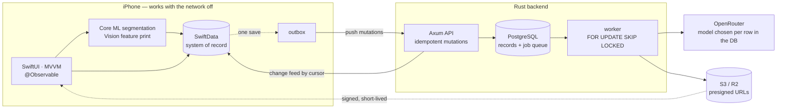

# ReLove — a daily outfit challenge that builds your wardrobe for you

[](https://github.com/ayungavis/wardrobe-app/actions/workflows/ios.yml)
[](https://github.com/ayungavis/wardrobe-app/actions/workflows/backend.yml)


Most wardrobe apps ask you to photograph your entire closet before they do anything useful. Nobody
finishes that. **ReLove never asks.** It gives you one creative outfit challenge a day, and the
wardrobe assembles itself from the photos you were going to take anyway — each completed challenge
segments the garments you wore, matches them against what it already knows, and files them.

A full-stack project: a **SwiftUI iOS app** that works entirely offline, and a **Rust backend** that
syncs it. Built solo, shipped to TestFlight, and demonstrated at an exhibition in August 2026.

**[Try it on TestFlight](https://testflight.apple.com/join/u5JgUWap)** — iOS 26 or later.

## Demo

<table>
  <tr>
    <td width="25%"></td>
    <td width="25%"></td>
    <td width="25%"></td>
    <td width="25%"></td>
  </tr>
  <tr>
    <td align="center"><sub>A challenge a day</sub></td>
    <td align="center"><sub>Non-destructive editor</sub></td>
    <td align="center"><sub>The wardrobe builds itself</sub></td>
    <td align="center"><sub>Every day you documented</sub></td>
  </tr>
</table>

**The app**

https://github.com/user-attachments/assets/14fb05bc-1b59-4fa4-ae69-a0ee322cbf06

**The team behind it**

https://github.com/user-attachments/assets/92b76ddc-28a1-41d6-abf4-b10bdc0326bd

## What it does

1. **A challenge a day.** A deck of prompts — *"Unused Wear: you haven't worn these in a while, mix
   and match them"* — drawn from what your wardrobe already knows. Swiping browses; only an explicit
   button accepts, because an accidental swipe should never start your day.
2. **Wear it, photograph it.** The camera opens only after you accept, so the permission prompt
   arrives with a reason attached.
3. **The app reads the outfit.** On-device Core ML segmentation cuts out each garment; a Vision
   feature print matches it against your existing items. Nothing leaves the phone for this step.
4. **You confirm, never the AI.** It proposes *"this looks like your brown pleated skirt"* — you
   decide. Duplicates are never merged automatically and a wear count never increments silently.
5. **The wardrobe grew.** One checkmark commits the completion, the history entry, the item changes,
   and the wear records — atomically, offline, and exactly once even if you tap twice.

## How it works



The phone is the system of record and never blocks on the network. Every mutation is queued in a
durable outbox, replayed until the server acknowledges it, and applied server-side by UUID so a
retry is a no-op. The phone pulls changes back by cursor. Slow work — AI illustration, outfit-page
generation — becomes a Postgres job the worker claims.

## Five decisions worth defending

Each of these cost something. That's what makes them decisions.

**1. Local-first, with a durable outbox.**
The app is fully usable in airplane mode. Tapping the checkmark writes the domain change *and* its
outbox entry in a **single SwiftData `save()`** — one `ModelContext` shared deliberately across the
repositories, because two contexts are two transactions and the atomicity would break silently
rather than loudly.
*The price:* conflict resolution becomes the app's problem. Two devices can complete the same day,
so the server keeps both and asks the user — which is why decision 3 exists.

**2. PostgreSQL is the job queue.**
Jobs are claimed with `FOR UPDATE SKIP LOCKED`. No Redis, no broker, no extra thing to operate.
*The price:* it will not scale forever, so the threshold that changes the answer is written down
rather than hand-waved as "we'll never need one".

**3. The schema enforces the product rules.**
"One canonical completion per user-local day" is a partial unique index —
`where status = 'canonical' and deleted_at is null` — not an `if` statement in a handler. A second
completion is preserved as a conflict for the user to resolve, never dropped.
*The price:* a partial unique index cannot be an `ON CONFLICT` target, so the write path is an
explicit lock-and-check transaction. Tests assert the *constraints*, against a real PostgreSQL, so
they cannot drift from what production enforces.

**4. AI proposes, the user decides.**
No duplicate is auto-merged, no wear count moves without confirmation, and a confirmed correction
always outranks the model. Which model runs is a **row in the database**, per capability — so
switching providers is an `UPDATE`, not a deploy.
*The price:* more taps than an app that guesses. Worth it: a wardrobe that quietly invents clothes
you don't own is worse than useless.

**5. Conventions are tests, not documents.**
`ConventionsTests`, `NetworkingConventionsTests`, and `conventions.rs` fail the build on a stray
comment, an endpoint folder whose files don't match its protocol conformance, a DTO without the
suffix, or a third architectural layer smuggled in.
*The price:* writing the check costs more than writing the rule. It is also the only version that
survives — the prose version drifted twice before it became a test.

## Engineering practice

| | |
| --- | --- |
| **Tests** | **845** iOS (Swift Testing, 107 suites) · **287** backend |
| **Real databases in tests** | **266 `#[sqlx::test]`** — each gets its own PostgreSQL with migrations applied. Nothing is mocked that can be run for real. |
| **Test code vs source** | Swift 16,313 / 25,192 lines · Rust 10,152 / 9,825 lines |
| **Migrations** | 17, forward-only — one that has run is never edited |
| **API docs** | `services/openapi.json` is committed and a test fails when it drifts from the handlers |
| **CI** | Split by path: an iOS change never runs Rust jobs; `main` auto-deploys to TestFlight |
| **Lint** | `swiftlint --strict` and `clippy -D warnings`, both zero-tolerance; the Rust toolchain is pinned so a new lint can't redden CI unreproducibly |

**Every guard is run red before it is trusted.** A test written against already-fixed code proves
only that it compiles, so each one is either written first or verified by reverting the behaviour
and watching it fail for the expected reason.

## What's shipped, and what isn't

| Shipped | Not yet |
| --- | --- |
| Daily challenge deck, capture, non-destructive layered editor | VoiceOver browsing for the card deck without swipe gestures |
| On-device garment segmentation and duplicate matching | Pull-to-refresh on the challenge screen |
| Local-first sync: outbox, idempotent mutations, cursor change feed | Splash-screen timeout handling |
| Conflict resolution for two completions on one local day | Cross-device restore beyond same-device Keychain |
| Sign in with Apple, anonymous identity, account linking and deletion | |
| AI outfit illustration and generated outfit-page templates | |
| S3-compatible media with short-lived signed URLs | |
| English and Indonesian throughout | |

<details>
<summary><h2>Running it locally</h2></summary>

### Prerequisites

**iOS** — Xcode 26+ (iOS 26 SDK), then `brew install xcodegen swiftlint swiftformat`

**Backend** — Docker, [Rust stable](https://rustup.rs), then
`cargo install sqlx-cli --no-default-features --features postgres,rustls`

### Repository layout

```
.
├── app/WardrobeApp/                   iOS app
│   ├── project.yml                    XcodeGen spec — source of truth for the Xcode project
│   ├── WardrobeApp/                   App target: @main entry (Sentry init), assets, xcconfigs
│   └── WardrobeKit/                   Local Swift package — all real code lives here
│       ├── Sources/DesignSystem/      Colors, typography, spacing, shadows, components
│       ├── Sources/WardrobeKit/       Core + Features (MVVM) + AppContainer + localization
│       └── Tests/WardrobeKitTests/    Unit tests (Swift Testing)
├── services/                          Rust backend
│   ├── compose.yaml                   Postgres 17 + MinIO
│   ├── migrations/                    sqlx migrations, forward-only
│   └── crates/                        api · db · worker · storage · observability
└── Makefile                           Every dev command, namespaced ios-* / backend-*
```

### iOS

```bash
git clone https://github.com/ayungavis/wardrobe-app && cd wardrobe-app

make ios-generate                              # the .xcodeproj is gitignored — never committed
open app/WardrobeApp/WardrobeApp.xcodeproj
```

Or without Xcode, on the booted simulator: `make ios-run`

**Signing:** the simulator needs none. For a physical device, set your team once in a gitignored file
that survives `make ios-generate`:

```bash
echo 'DEVELOPMENT_TEAM = YOUR_TEAM_ID' > app/WardrobeApp/WardrobeApp/Config/Local.xcconfig
make ios-generate
```

⚠️ Never edit the `.xcodeproj` directly — XcodeGen overwrites it; `project.yml` is the only source of
truth.

### Backend

```bash
make backend-up        # Postgres + MinIO, waits until both are healthy
make backend-migrate   # apply the schema
make backend-run       # serve the API
```

With the API running, <http://localhost:8080/docs> is Swagger UI and <http://localhost:8080/health>
reports whether the service *and its database* are reachable.

`services/.env` is created from `.env.example` on first use. Local ports are deliberately **not** the
defaults — Postgres is on **5433**, MinIO on **9100/9101** — because a system Postgres on 5432 is
common enough that sharing it would be the first thing every new machine tripped over.

### Commands

| Command | What it does |
| --- | --- |
| `make` | List every target with its description |
| `make ios-generate` | Regenerate `WardrobeApp.xcodeproj` (run after clone / editing `project.yml`) |
| `make ios-format` | SwiftFormat the whole repo |
| `make ios-lint` | SwiftLint in strict mode |
| `make ios-test` | Unit tests via `swift test` — no simulator needed |
| `make ios-build` | Build for iPhone simulator (full log: `/tmp/wardrobeapp-build.log`) |
| `make ios-run` | Build + install + launch on the booted simulator |
| `make ios-validate` | format → lint → test → build |
| `make backend-up` / `backend-down` | Start / stop Postgres and MinIO |
| `make backend-migrate` | Apply migrations |
| `make backend-reset` | Drop and rebuild the database from empty |
| `make backend-run` | Serve the API — Swagger UI at `/docs` |
| `make backend-openapi` | Regenerate `services/openapi.json` from the handlers |
| `make backend-test` | `cargo test` (starts the containers it needs) |
| `make backend-validate` | fmt → clippy → test |
| `make validate` | Both sides. **Must pass before every PR.** |

### Release builds

**Release builds carry no configuration from this repository.** `Release.xcconfig` defines neither
`API_BASE_URL` nor `SENTRY_DSN`; the TestFlight workflow passes both to `xcodebuild` from GitHub
Actions secrets of the same name. To make one locally, supply them yourself:

```bash
xcodebuild -project app/WardrobeApp/WardrobeApp.xcodeproj -scheme WardrobeApp \
  -configuration Release -destination 'generic/platform=iOS' \
  API_BASE_URL=https://your-api.example.com SENTRY_DSN=https://…  build
```

Both values end up in the app's `Info.plist`, so keeping them out of the repository hides them from
readers and scrapers — not from anyone holding a build. Rate limits and spending caps belong on the
services themselves.

### Troubleshooting

| Symptom | Fix |
| --- | --- |
| Xcode: "Signing for WardrobeApp requires a development team" | Set your team — see *Signing* above |
| Simulator: "Requires a newer version of iOS" | Update the runtime (Xcode ▸ Settings ▸ Components) or lower `deploymentTarget` in `project.yml` |
| `make ios-build` fails with no obvious error | Full log is at `/tmp/wardrobeapp-build.log` |
| Project won't open / files missing in Xcode | Re-run `make ios-generate` — the `.xcodeproj` is generated and gitignored |
| `make backend-up`: "port is already allocated" | Something else holds 5433 or 9100 — change it in `services/.env`, then `make backend-down && make backend-up` |
| `make backend-*`: "Cannot connect to the Docker daemon" | Docker Desktop is not running |
| `make backend-migrate`: `sqlx: command not found` | `cargo install sqlx-cli --no-default-features --features postgres,rustls` |

</details>

## License

The ReLove source code is released under the [MIT License](LICENSE).

**Two exceptions, neither of which MIT can override:**

- **The bundled Core ML model.** `WardrobeKit/Sources/WardrobeKit/Models/` holds a Core ML conversion
  of the [FASHN Human Parser](https://github.com/fashn-AI/fashn-human-parser), a SegFormer-B4
  fine-tune. It carries the **NVIDIA Source Code License for SegFormer**, which permits
  redistribution but limits **use to non-commercial research or evaluation**. The full licence and
  attribution sit beside the weights in
  [`Models/LICENSE-SegFormer.txt`](app/WardrobeApp/WardrobeKit/Sources/WardrobeKit/Models/LICENSE-SegFormer.txt)
  and [`Models/NOTICE.md`](app/WardrobeApp/WardrobeKit/Sources/WardrobeKit/Models/NOTICE.md).
  Shipping this app commercially means replacing that model first.
- **Fonts and artwork.** `DesignSystem/Resources/Fonts/` and the sticker, paper, and template images
  in `Assets.xcassets/` come from third parties and keep their own terms.
