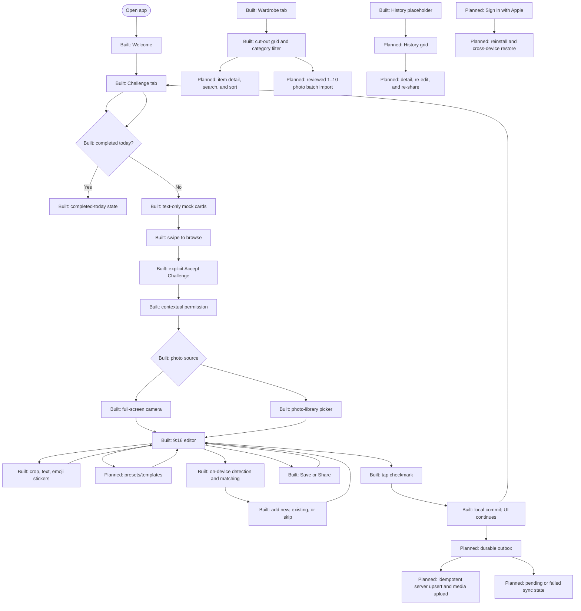

# Wardrobe Challenge App — MVP Product Requirements Document

## Changelog from version 2.1

| Change                                                                                                                                            | Why                                                                                                 |
| ------------------------------------------------------------------------------------------------------------------------------------------------- | --------------------------------------------------------------------------------------------------- |
| Marked each functional requirement as **Built**, **Partial**, **Not built**, or **Target architecture**                                           | The previous document described planned screens as if they already worked                           |
| Made `docs/prd.md` the canonical PRD path                                                                                                         | Keeps one current document instead of parallel copies                                               |
| Chose **Sign in with Apple for MVP**, with anonymous Keychain identity linked on first sign-in                                                    | Same-device Keychain restore cannot satisfy the cross-device promise                                |
| Defined local-first writes with a durable outbox and server reconciliation                                                                        | Challenge completion must never wait for the network, while the server remains the system of record |
| Fixed the backend to Rust, Axum, sqlx, PostgreSQL, an API binary, and a queue-worker binary                                                       | These implementation choices are now decided rather than open dependencies                          |
| Fixed deployment to one Docker Compose stack on a single VPS                                                                                      | Local and production topology are now known                                                         |
| Fixed media storage to MinIO locally and Cloudflare R2 in production, accessed through short-lived signed URLs                                    | Original photos, derivatives, cut-outs, and illustrations must survive reinstall                    |
| Kept garment detection, normalization, fingerprinting, and matching on device                                                                     | Review must be immediate, offline-capable, and authoritative before upload                          |
| Added entity-specific sync, ownership, conflict, retention, deletion, and restore rules                                                           | A blanket “last write wins” rule would corrupt identity, completions, or media                      |
| Corrected feature status for History, Wardrobe metadata, search/sort/detail, presets, settings, recommendation previews, and batch gallery import | These remain requirements but are not built today                                                   |

### Document metadata

| Field                   | Value                                                                              |
| ----------------------- | ---------------------------------------------------------------------------------- |
| Status                  | Current product and implementation specification                                   |
| Version                 | 3.0                                                                                |
| Updated                 | 15 August 2026                                                                     |
| Product                 | Wardrobe Challenge App (working title)                                             |
| Platforms               | Swift iOS mobile app; Rust Axum backend; PostgreSQL database                       |
| Primary validation goal | Determine whether daily creative challenges increase reuse of rarely worn clothing |

## 1. Executive summary

The product helps fashion-conscious people in their 20s reuse more clothes they already own through one creative Outfit of the Day challenge per day. The working iOS app already provides Welcome, three tabs, a stacked challenge deck, explicit acceptance, full-screen capture, a 9:16 editor, on-device garment detection and matching, local persistence, and a normalized-cut-out Wardrobe grid.

The wardrobe grows progressively from completed challenge photos and optional imports of selected gallery outfit photos. Import is an MVP feature inside Wardrobe, not a required onboarding step. When the app lacks wardrobe history, challenge cards use approachable text such as “Today is a good day to wear …”. When confirmed wardrobe items are available, the app prioritizes rarely worn pieces and may show an outfit preview based on those items. A missing preview image must never block a text-only challenge.

The primary navigation has three tabs: **Challenge**, **Wardrobe**, and **History**. Camera and editor steps are full-screen and hide the tab bar. History is currently an empty placeholder; its grid, detail, re-edit, and re-share flows remain MVP requirements. Wardrobe search, sort, detail, richer metadata, personal labels, recommendation previews, presets/templates, profile/settings, deletion controls, and reviewed batch gallery import are also not built.

The target MVP adds a Rust/Axum/PostgreSQL backend, object storage, sync, Sign in with Apple, account deletion, and server-rendered item illustrations. The app remains local-first: ✓ commits locally and the UI moves immediately; a durable outbox synchronizes later. The server is the recoverable system of record, while detection and item-identity decisions remain device-authoritative.

## 2. Background and evidence

The available interview evidence is limited to these findings:

- Low prices reduce hesitation about buying multiple thrifted or inexpensive clothing items.
- Users want to make better use of their existing wardrobes.
- Users often lack motivation to style rarely worn clothing.
- Photographing and cataloguing every garment creates too much friction.
- People in their 20s respond better to engaging, challenge-based experiences than information-heavy sustainability products.

The finalized lo-fi contributes product and interaction decisions, not new user-research evidence. Market size, willingness to pay, ideal challenge quantity, preferred reset time, acceptable editing depth, recommendation-image value, and purchase-frequency change remain unvalidated.

## 3. Problem statement

Fashion-conscious people in their 20s can accumulate inexpensive or thrifted clothing faster than they reuse it. They want to shop more intentionally and wear more of what they own, but overlooked pieces are easy to forget and traditional digital closet setup feels like work. The product must make wardrobe creation a by-product of a fun daily outfit experience rather than a prerequisite for receiving value.

## 4. Product vision and principles

### Vision

Make rediscovering an existing wardrobe as visually rewarding and creatively motivating as finding something new to buy.

### Principles

1. **Create value before building the wardrobe:** A first-time user can choose a challenge before having wardrobe history.
2. **Progressive wardrobe creation:** Confirmed challenge photos and optional selected gallery imports add or update items over time; full upfront cataloguing is unnecessary.
3. **AI assists; users decide:** AI proposes items, attributes, matches, duplicates, and recommendations, but users confirm consequential changes.
4. **Creative rather than judgmental:** Prompts invite experimentation and never shame users for purchases or unworn items.
5. **Text must stand alone:** Recommendation imagery enhances a challenge but is never required to understand or accept it.
6. **Sharing stays optional:** A user can complete the full loop privately without saving or sharing externally.
7. **Local-first, server-record:** User actions commit locally without network latency, then synchronize durably to the server for reinstall and multi-device restore.
8. **Device-authoritative item identity:** Detection, cut-out normalization, fingerprinting, matching, and confirmed corrections run on device; the server stores and distributes the confirmed result but never re-detects or revises it.

## 5. Target audience and primary persona

### Primary audience

A fashion-conscious person in their 20s who regularly buys inexpensive or thrifted clothing, owns liked but rarely worn items, enjoys Outfit of the Day content, wants to shop more intentionally, and does not want to catalogue an entire wardrobe manually.

### Operational persona

**The Creative Rewearer**

- **Goal:** Find a fresh reason to style clothes they already own.
- **Current behavior:** Takes outfit photos, consumes visual fashion content, and makes low-friction clothing purchases.
- **Barrier:** Wardrobe organisation feels like setup work; overlooked items are out of mind.
- **Motivator:** A specific daily prompt, a polished photo, and visible outfit history.
- **Trust need:** Control over camera access, AI corrections, wardrobe identity, photo editing, and sharing.

This persona is a synthesis of the supplied target definition, not an additional research finding.

## 6. Jobs to be done

1. **When I want inspiration for today’s outfit,** give me several lightweight challenge options, **so I can choose one that feels exciting.**
2. **When I finish styling the challenge,** help me capture and personalize the outfit, **so the result feels worth keeping.**
3. **When the app detects my clothes,** let me review uncertain or new items without leaving the creative flow, **so my wardrobe becomes trustworthy over time.**
4. **When I return later,** help me find clothes and past outfits visually, **so I can rediscover what I own and how I styled it.**
5. **When I want better recommendations sooner,** let me import selected outfit photos I already have, **so I can backfill my wardrobe without cataloguing garments individually.**

## 7. User needs and pain points

| User need                        | Current pain                                        | MVP response                                                                                 |
| -------------------------------- | --------------------------------------------------- | -------------------------------------------------------------------------------------------- |
| Reach value immediately          | Upfront wardrobe setup delays the fun               | Welcome goes directly to a usable text-first challenge deck                                  |
| Choose rather than be told       | A single recommendation may not fit mood or context | Swipeable stack with several options and explicit acceptance                                 |
| Keep creativity central          | Data review can interrupt editing                   | AI item review lives in a collapsible drawer inside the editor                               |
| Build a wardrobe with low effort | Garment-by-garment capture is too much work         | Challenge photos and optional selected gallery imports progressively create and update items |
| Rediscover items visually        | Conventional grids can feel utilitarian             | “Jemuran”-inspired wardrobe presentation with search, filters, and sort                      |
| Revisit outfit memories          | Lists underplay visual content                      | Unsplash-style history grid with detail and re-editing                                       |
| Maintain control                 | AI and photo access can feel invasive               | Contextual consent, corrections, non-destructive editing, optional sharing                   |

## 8. Product hypothesis

**If users receive enjoyable daily styling challenges that increasingly feature rarely worn wardrobe items, then they will reuse more of their wardrobe and reduce the frequency or quantity of impulsive clothing purchases.**

The MVP directly tests challenge selection, completion, and confirmed wardrobe reuse. Purchase-frequency change is a lagging, self-reported outcome and must not be inferred from engagement alone.

## 9. Core product loop

1. A new user sees the product value and continues to Challenge.
2. The app presents several daily challenge cards in a stacked carousel.
3. With no history, cards are understandable as text-only prompts.
4. With confirmed wardrobe data, the app prioritizes rarely worn items and may add a wardrobe-based outfit preview.
5. The user swipes to browse and taps **Accept Challenge** on one card.
6. The full-screen camera requests permission contextually and the user takes a photo.
7. The full-screen editor offers crop, text, stickers, face cover, and a small template/preset collection.
8. AI scans clothing while the user edits; an item icon opens a collapsible review drawer.
9. The user confirms or corrects new, uncertain, or possible duplicate items.
10. The user may save or share the edited image.
11. The user taps the checkmark; the app commits the completion, confirmed items, wear records, and media references locally without waiting for the network.
12. Challenge immediately shows the completed-today state. A durable outbox uploads idempotent records and media; History and other devices reconcile from the server when those features are available.

### Planned Wardrobe gallery-import loop

**Build status:** Not built. The working capture screen can select one existing photo, but the Wardrobe batch flow below is still required for MVP.

1. From Wardrobe, the user taps **Import Outfit Photos**.
2. The app explains selected-photo processing and requests full or limited photo-library access contextually.
3. The user selects 1–10 existing outfit photos; the app never scans the full library automatically.
4. AI detects garments, suggests existing-item matches and duplicates, and reads capture dates when reliable.
5. The user confirms or corrects items and dates using the same wardrobe review rules as challenge photos.
6. The app atomically adds confirmed items and historical wear records, then returns to Wardrobe.

## 10. MVP user flow

The daily challenge remains the primary flow. Labels state implementation status; **Built** means working in the current iOS app, while **Planned** means still required for MVP.

### Flow clarifications

- Horizontal swipes browse cards only; they do not accept, reject, or permanently dismiss a challenge.
- Acceptance requires an explicit button.
- An accepted challenge remains active if the user leaves the camera or editor. The user may resume or abandon it before completion.
- The tab bar is hidden on camera and editor screens to preserve focus and screen space.
- Saving or sharing does not complete the challenge. Only the checkmark commits completion.
- After completion, no challenge cards appear again until the daily reset.
- The working photo-library picker supplies the active challenge with one existing photo. The planned Wardrobe batch import remains a separate flow and creates wear history but no challenge completion.
- ✓ commits locally and never waits for upload, account refresh, illustration rendering, or any server response.

## 11. User-flow exceptions and recovery paths

| Exception                                   | Required behavior                                                                                           | Recovery outcome                                                                            |
| ------------------------------------------- | ----------------------------------------------------------------------------------------------------------- | ------------------------------------------------------------------------------------------- |
| No wardrobe history                         | Present complete text-only prompts; do not show an empty-image placeholder                                  | User can accept a first challenge immediately                                               |
| Wardrobe item imagery is insufficient       | Keep the same challenge text and omit the preview image                                                     | Recommendation remains understandable and actionable                                        |
| Challenge deck fails to load                | Show a retry and preserve the daily state; do not fabricate completion                                      | User retries without restarting onboarding                                                  |
| Accepted challenge is exited                | Persist its status and draft photo/edit state when available                                                | User resumes or explicitly abandons it                                                      |
| Camera access denied                        | Explain why capture is needed and how to enable it in iOS settings                                          | User retries permission or returns to Challenge                                             |
| Photo capture fails                         | Keep the active challenge and show the failed operation                                                     | User retakes without losing the challenge                                                   |
| Clothing scan is loading                    | Keep editing available; item icon shows progress                                                            | User continues editing and reviews items when ready                                         |
| No garment is detected                      | Explain the limitation and offer retake or explicit manual item entry                                       | User resolves wardrobe review without automatic challenge failure                           |
| Detection is uncertain                      | Mark the affected fields clearly in the item drawer                                                         | User confirms, edits, or removes the candidate                                              |
| Possible duplicate                          | Show both candidates and history; never merge automatically                                                 | User merges, rejects, or defers                                                             |
| Editor, upload, or API fails                | Preserve the original photo and local draft where possible                                                  | User retries safely; no duplicate completion or wear record                                 |
| Save/share fails                            | Keep the edited preview and state whether challenge completion is still pending                             | User retries or completes without sharing                                                   |
| Completion succeeds but refresh fails       | Treat completion as committed and show a retryable refresh state                                            | User never has to complete the same challenge twice                                         |
| Daily reset occurs during editing           | Allow the already accepted challenge to finish once                                                         | Completion is attributed to the acceptance day and no second challenge unlocks accidentally |
| Photo-library access is denied or limited   | Explain selected-photo access and settings; process only assets the user explicitly selects                 | User retries, adds more selected photos later, or returns to Wardrobe                       |
| Imported photo has no detected garments     | Identify the affected photo without discarding successful results from the batch                            | User removes it or chooses a clearer photo                                                  |
| Imported photo has no reliable capture date | Leave its wear date unresolved; never substitute the import date                                            | User chooses a date before that photo's wear records can be committed                       |
| Import batch fails or is interrupted        | Preserve selected assets and completed review work where allowed by iOS access                              | User resumes or retries without duplicate items or wears                                    |
| Device is offline at completion             | Commit locally, show completed-today immediately, enqueue all structured records and media                  | Outbox retries after connectivity returns; the user does not repeat the challenge           |
| Sync remains pending                        | Show a non-blocking pending state on affected records                                                       | User continues using the app; manual retry is available where useful                        |
| Sync fails after retry/backoff              | Preserve local data and show the failed operation without claiming server backup                            | User retries; diagnostics expose correlation ID but no private content                      |
| App is reinstalled on the same device       | Recover anonymous identifier from Keychain, authenticate it with the server, and incrementally restore data | Local cache rebuilds while usable placeholders show progress                                |
| User opens the app on another device        | Require Sign in with Apple and restore the linked account                                                   | Anonymous-only data cannot appear on another device until it is linked                      |
| Illustration is still rendering             | Show the normalized cut-out and a rendering state                                                           | Illustration replaces the placeholder when the worker succeeds                              |
| Illustration rendering fails                | Keep the cut-out and expose retry/status without blocking Wardrobe                                          | Worker retries according to job policy; user data remains usable                            |
| Signed URL expires during media load        | Request a new signed URL; never persist the expired URL as the asset identity                               | Media reloads without duplicating the object or record                                      |

## 12. Information architecture and navigation

The finalized three-tab navigation is sufficient for MVP.

| Destination   | Purpose                                     | Current build                                                                       | MVP target                                                                                   |
| ------------- | ------------------------------------------- | ----------------------------------------------------------------------------------- | -------------------------------------------------------------------------------------------- |
| **Challenge** | Choose, resume, or finish today’s challenge | Working stacked mock-card deck, active challenge persistence, completed-today state | Server-backed challenge catalog, wardrobe-aware cards, text-only fallback, optional previews |
| **Wardrobe**  | Find, import, and inspect detected clothing | Working normalized cut-out grid, category filter, empty state                       | Search, sort, item detail, labels/status, illustrations, reviewed batch import, sync states  |
| **History**   | Revisit and re-edit completed outfits       | Empty placeholder                                                                   | Synced image grid, detail, item list, re-edit, re-share, restore states                      |

Profile/settings, account state, permissions, sync diagnostics, privacy controls, and deletion controls remain MVP requirements behind a profile entry; the screen is not built. They do not occupy a fourth tab.

### Visual direction

- **Wardrobe:** The current build uses a standard cut-out grid. The “jemuran” reference remains a planned visual direction, subject to usability and accessibility validation. Use original product assets; do not reproduce the Pinterest artwork, typography, or decorative composition.
- **History:** Use a dense, image-led masonry or adaptive grid inspired by Unsplash. Stable ordering and predictable touch targets take priority over decorative irregularity.

## 13. MVP scope

### 13.1 Confirmed product decisions

| #   | Default decision                                                                                                                           | Reason                                                                                                                       | Main trade-off                                                                               | Evidence needed                                                  | Change when                                                                 |
| --- | ------------------------------------------------------------------------------------------------------------------------------------------ | ---------------------------------------------------------------------------------------------------------------------------- | -------------------------------------------------------------------------------------------- | ---------------------------------------------------------------- | --------------------------------------------------------------------------- |
| 1   | Welcome continues directly to Challenge; no gallery-import setup                                                                           | Reaches value before asking users to build data                                                                              | First recommendations cannot be personalized                                                 | First-session acceptance/completion                              | Generic prompts fail to create first-session value                          |
| 2   | One completed challenge per user-local calendar day                                                                                        | Creates a clear, lightweight habit                                                                                           | Users cannot complete multiple prompts when motivated                                        | Completion frequency and requests for more                       | Additional attempts improve retention without fatigue                       |
| 3   | Present several daily cards; swipes browse and an explicit button accepts                                                                  | Supports choice without ambiguous Tinder-style commitment                                                                    | Requires an extra tap                                                                        | Browse depth, acceptance time, mis-taps                          | Users strongly expect swipe-right acceptance after testing                  |
| 4   | With no history, use text such as “Today is a good day to wear …”                                                                          | Works with zero wardrobe data                                                                                                | Prompts may feel generic                                                                     | First-user acceptance and prompt ratings                         | Category/color prompts are still too vague                                  |
| 5   | With history, prioritize rarely worn confirmed items and show their imagery when suitable                                                  | Connects the daily experience to wardrobe reuse                                                                              | Item data and imagery may be incomplete                                                      | Acceptance, reuse, image coverage                                | Other recommendation logic performs better                                  |
| 6   | MVP preview images are simple compositions of owned-item reference crops; no generative try-on                                             | Meets the visual intent with bounded technical and trust risk                                                                | Does not depict a person wearing the combination                                             | Preview usefulness and comprehension                             | Users need styled-on-body inspiration and its safety/cost are validated     |
| 7   | Text-only is the permanent fallback when a useful preview cannot be produced                                                               | Prevents image scarcity from blocking the core loop                                                                          | Inconsistent card richness                                                                   | Acceptance with/without previews                                 | Consistency matters more than optional imagery                              |
| 8   | Request camera permission only after challenge acceptance and a short explanation                                                          | Permission is contextual and easier to understand                                                                            | Adds a step before capture                                                                   | Permission grant and return rates                                | Earlier education measurably improves trust                                 |
| 9   | AI item review opens from a persistent icon into a collapsible bottom sheet/drawer                                                         | Keeps editing central while making wardrobe data available                                                                   | Some users may miss the drawer                                                               | Drawer discovery and unresolved-review rate                      | Inline review proves clearer without harming editing                        |
| 10  | Require resolution of new, uncertain, and duplicate items before completion; existing high-confidence matches receive one-tap confirmation | Protects wardrobe identity and wear history                                                                                  | Adds completion effort                                                                       | Review time, corrections, abandonment                            | The gate becomes the main source of incomplete challenges                   |
| 11  | MVP editor includes crop, text, stickers, face cover, and a small preset/template collection                                               | Delivers the lo-fi’s creative value without a full editor platform                                                           | Fewer creative options than CapCut/Canva                                                     | Tool use and share intent                                        | Users avoid keeping/sharing results due to missing tools                    |
| 12  | Share/save and completion are independent; only the checkmark completes                                                                    | Preserves optional sharing and explicit commitment                                                                           | Two actions can be confused                                                                  | Mis-taps and uncompleted shared photos                           | Testing shows a clearer combined confirmation is needed                     |
| 13  | Wardrobe uses the “jemuran” metaphor; History uses an image-led grid                                                                       | Gives each collection a distinct, memorable purpose                                                                          | Custom layouts cost more than standard lists                                                 | Findability, performance, accessibility                          | The metaphor reduces discovery or accessibility                             |
| 14  | Gallery import is optional from Wardrobe, accepts 1–10 selected outfit photos per batch, and reuses the existing item-review pipeline      | Adds historical coverage without restoring high-friction onboarding or a second data model                                   | Batch review adds complexity and processing cost                                             | Import completion, time, corrections, recommendation eligibility | Users need larger batches or import belongs earlier in the journey          |
| 15  | The server is the system of record; the iOS store is a local cache and immediate-write surface                                             | Reinstall and multi-device restore require durable remote state without adding network latency to the loop                   | Sync and conflict handling become core product work                                          | Restore and conflict tests                                       | This principle changes only with an explicit architecture revision          |
| 16  | Detection, cut-out normalization, fingerprinting, duplicate matching, and item-identity confirmation stay on device                        | Review must appear immediately, work offline, and gate upload                                                                | The server cannot independently repair identity mistakes                                     | Detection latency, offline completion, correction rate           | Device constraints make the required experience impossible                  |
| 17  | Every local mutation uses a client UUID and enters a durable outbox for idempotent server upsert                                           | ✓ must never wait for a network response, and retries must never duplicate data                                              | Users can temporarily see pending or failed backup state                                     | Sync latency, retry success, duplicate rate                      | A simpler protocol proves equally safe under offline and multi-device tests |
| 18  | Sign in with Apple is in MVP; anonymous Keychain identity is linked on first sign-in                                                       | Same-device Keychain restore does not satisfy the explicit cross-device promise                                              | Adds authentication UI, Apple-token verification, linking, merge, and account-deletion scope | Sign-in completion, link conflicts, restore success              | Cross-device restore is explicitly removed from MVP                         |
| 19  | Backend uses Rust, Axum, sqlx, PostgreSQL, and two binaries in one workspace: HTTP API and queue worker                                    | Matches the implementation plan and keeps deployment simple                                                                  | API and worker share a database and deployment boundary                                      | Load and operational testing                                     | Measured scale or isolation needs require separation                        |
| 20  | One Docker Compose stack runs on a single VPS in local development and production                                                          | Lowest operational complexity for MVP                                                                                        | Single-host availability and scaling ceiling                                                 | Backup, restore, load, and failure drills                        | Availability or capacity requirements exceed the VPS                        |
| 21  | Media uses S3-compatible storage: MinIO locally and Cloudflare R2 in production; access uses short-lived signed URLs                       | Media must survive reinstall without public object access                                                                    | Adds upload orchestration and object lifecycle management                                    | Upload/download reliability and security review                  | Storage requirements materially change                                      |
| 22  | PostgreSQL is the job queue; workers claim jobs with `FOR UPDATE SKIP LOCKED`                                                              | Avoids an external broker while supporting asynchronous illustrations                                                        | Database queue throughput has a known ceiling                                                | Queue latency and database load                                  | Measured volume requires a broker                                           |
| 23  | The worker renders one styled illustration asynchronously for each genuinely new item                                                      | iOS exposes no headless generative-image API; bundling a diffusion model would add roughly 1–2 GB and 5–20 seconds per image | Illustration is eventually consistent and can fail independently                             | Render success, latency, user value                              | Illustrations do not justify their cost or a different renderer is chosen   |

### 13.2 In-scope outcomes

- A first-time user can accept and complete a text-first challenge without an existing wardrobe.
- A returning user can receive rarely worn-item challenges with optional wardrobe-based previews.
- A completed outfit progressively creates or updates confirmed wardrobe items and wear history.
- A user can edit the photo without losing control of AI-detected item data.
- A user can find items and outfit history through visual collections, search, filters, and sort.
- A user can re-edit an outfit derivative and optionally save/share it again.
- A user can import selected gallery outfit photos, confirm detected items and wear dates, and use that history for wardrobe-aware challenges.
- A completion works offline, appears immediately, and synchronizes later without duplication.
- A signed-in user can reinstall or use another phone and restore wardrobe items, fingerprints, wear history, challenge completions, original photos, edited derivatives, cut-outs, and illustrations.

### 13.3 Identity and account model

**MVP decision: Sign in with Apple is required to deliver cross-device restore.**

| State     | Identifier                                               | What works                                                                                                | Limitation                                                                           | Transition                                                                           |
| --------- | -------------------------------------------------------- | --------------------------------------------------------------------------------------------------------- | ------------------------------------------------------------------------------------ | ------------------------------------------------------------------------------------ |
| Anonymous | Client-generated anonymous UUID stored in iOS Keychain   | Full local product use; local-first writes; same-device reinstall restore after backend sync is available | Keychain identity does not travel to another phone                                   | User chooses Sign in with Apple                                                      |
| Linking   | Anonymous UUID plus verified Apple identity              | Local pending writes sync; server transactionally associates anonymous server data with the account       | Restore waits until linking and conflict reconciliation finish                       | Successful link enters Signed in; failure keeps Anonymous data intact                |
| Signed in | Stable server account linked to Apple subject identifier | Same-device and cross-device restore, incremental sync, account deletion                                  | Requires network for first sign-in and remote restore; daily use remains local-first | Sign out returns the device to an anonymous local state without deleting server data |

The backend verifies Apple credentials and never trusts an unverified client account identifier. Linking unions records by client UUID. Wardrobe items are never auto-merged merely because two devices produced similar fingerprints. Any local data that cannot be linked safely remains on device with an actionable retry state.

**Cost of this choice:** MVP must include Sign in with Apple UI, server credential verification, anonymous-to-account linking, multi-device conflict handling, signed-in/signed-out states, token/session security, restore UX, and account deletion. Without that work, the product may promise same-device restore only and must not claim cross-device sync.

### 13.4 Current implementation boundary

| Area              | Built and working                                                                                                                                                                                       | Not built yet but retained in MVP                                                             |
| ----------------- | ------------------------------------------------------------------------------------------------------------------------------------------------------------------------------------------------------- | --------------------------------------------------------------------------------------------- |
| iOS foundation    | Swift 6, SwiftUI, MVVM with `@Observable`; real code in a local Swift package; separate tokenized design-system module; English and Indonesian                                                          | Server integration and sync UI                                                                |
| Challenge         | Three tabs, Welcome, stacked mock-card deck, explicit accept, local active state, one completion per local day, completed-today state                                                                   | Server cards, wardrobe awareness, preview images                                              |
| Capture           | Full-screen camera, flash, zoom, rotation, autofocus, contextual permissions, Instagram-style single-photo picker                                                                                       | Reviewed Wardrobe batch import and resume                                                     |
| Editor            | 9:16 non-destructive draft, crop, Instagram-style text composer, fonts, alignment, palette, emoji stickers, drag-to-trash, Save, Share, ✓, flattened 1080×1920 export with EXIF/GPS removed             | Presets/templates and synced History re-edit state                                            |
| Computer vision   | On-device Core ML segmentation, mask repair, 1024² cut-out normalization, CIE Lab colour signature, aspect ratio, Vision feature print, tunable duplicate scoring, add-new/existing/skip review choices | Names, explicit colour field, garment type, server illustration                               |
| Local persistence | SwiftData for wardrobe items, fingerprints, and wear records; lightweight key-value storage for challenge state; disk files for original photos and cut-outs                                            | Durable outbox, pull cursor, server-backed cache reconciliation, restored media cache         |
| Wardrobe          | SwiftData items/fingerprints/wears, file-backed cut-outs, grid, category filter, empty state                                                                                                            | Search, sort, detail, wear timeline, labels, “jemuran” layout, sync states                    |
| History           | Tab placeholder                                                                                                                                                                                         | Grid, detail, item list, re-edit, re-share, restore                                           |
| Backend/account   | None; no networking, accounts, identity, or remote storage                                                                                                                                              | All Rust/Axum/PostgreSQL, object storage, worker, Sign in with Apple, sync, deletion, restore |

## 14. Functional requirements

Priority meanings: **Must** is required for launch, **Should** is expected unless delivery evidence forces a cut, **Could** is the first removable scope, and **Won’t** is excluded from MVP.

### 14.0 Build-status index for FR-001–FR-050

This status reflects the current iOS implementation, not design completion. Requirements remain in scope unless §21 says otherwise.

| Status        | Requirement IDs                                                                                                         | Current boundary                                                                                                 |
| ------------- | ----------------------------------------------------------------------------------------------------------------------- | ---------------------------------------------------------------------------------------------------------------- |
| **Built**     | FR-001–FR-004, FR-007–FR-008, FR-011–FR-012, FR-014–FR-016, FR-018, FR-021–FR-022, FR-025, FR-027–FR-028, FR-030–FR-032 | Working in the local iOS app                                                                                     |
| **Partial**   | FR-006                                                                                                                  | Card deck works through a mock repository; no server catalog                                                     |
| **Partial**   | FR-013                                                                                                                  | Permission is contextual, but server-processing, retention, and upload disclosure are not built                  |
| **Partial**   | FR-017                                                                                                                  | Active challenge persists locally; full draft-abandon recovery is not confirmed complete                         |
| **Partial**   | FR-019                                                                                                                  | Crop, text, emoji stickers, and drag-to-trash work; a dedicated face-cover control is not confirmed              |
| **Partial**   | FR-023–FR-024                                                                                                           | Cut-out and category exist; name, explicit colour, garment type, counts/dates, and full attribute editing do not |
| **Partial**   | FR-026                                                                                                                  | Existing-item selection works; complete merge/reject/defer behavior is not built                                 |
| **Partial**   | FR-029                                                                                                                  | Local completion/item/wear commit works; History creation and server synchronization do not                      |
| **Partial**   | FR-033                                                                                                                  | Cut-out grid and empty state work; “jemuran” layout and batch-import entry do not                                |
| **Partial**   | FR-035                                                                                                                  | Category filtering works; remaining filters and sort options do not                                              |
| **Not built** | FR-005, FR-009–FR-010, FR-020, FR-034, FR-036–FR-050                                                                    | Retained as MVP scope; screens or behavior do not exist today                                                    |

### 14.1 Onboarding and navigation

| ID     | Priority | Story                  | Flow step       | Requirement and observable acceptance criteria                                                               | Error or recovery behavior                                                               |
| ------ | -------- | ---------------------- | --------------- | ------------------------------------------------------------------------------------------------------------ | ---------------------------------------------------------------------------------------- |
| FR-001 | Must     | US-001                 | Welcome         | Explain the daily creative-challenge value without requesting camera or gallery access.                      | Interrupted onboarding resumes at Welcome without losing product state.                  |
| FR-002 | Must     | US-001                 | Continue        | Continue directly to Challenge and mark onboarding complete.                                                 | A failed state fetch opens Challenge with a retryable loading state, not a setup wizard. |
| FR-003 | Must     | US-001                 | Main navigation | Provide exactly three primary tabs: Challenge, Wardrobe, and History.                                        | Preserve the selected tab across ordinary app background/foreground cycles.              |
| FR-004 | Must     | US-001, US-004, US-005 | Camera/editor   | Hide the tab bar on camera and editor screens; back/cancel behavior is explicit.                             | Leaving preserves the active challenge and any safely persisted draft.                   |
| FR-005 | Must     | US-012                 | Profile/privacy | Provide permission status, privacy notice, photo deletion, and account/data deletion behind a profile entry. | Failed deletion is never reported as complete and can be retried safely.                 |

### 14.2 Daily challenge discovery

| ID     | Priority | Story          | Flow step             | Requirement and observable acceptance criteria                                                                                          | Error or recovery behavior                                                                                   |
| ------ | -------- | -------------- | --------------------- | --------------------------------------------------------------------------------------------------------------------------------------- | ------------------------------------------------------------------------------------------------------------ |
| FR-006 | Must     | US-002         | Challenge deck        | For each eligible day, provide a bounded list of challenge cards with unique IDs and understandable text.                               | Deck failure shows retry; the server does not silently replace an accepted/completed daily state.            |
| FR-007 | Must     | US-002         | Browse cards          | Present cards as a stacked carousel. Left/right swipes move between options but do not accept, reject, or permanently dismiss them.     | Provide visible buttons and VoiceOver actions as non-swipe alternatives.                                     |
| FR-008 | Must     | US-002         | No history            | When no confirmed wardrobe item exists, show text-first prompts such as “Today is a good day to wear [prompt].”                         | Never display broken, empty, or mandatory image containers.                                                  |
| FR-009 | Must     | US-002         | Wardrobe-aware cards  | When history exists, prioritize eligible rarely worn items using confirmed wear data and identify the referenced item in the card text. | If no eligible item exists, use a general or user-choice prompt without claiming rarity.                     |
| FR-010 | Should   | US-002         | Preview image         | When suitable item reference crops exist, display a simple outfit composition based on the recommended owned items.                     | If composition fails or coverage is insufficient, render the same card as text-only.                         |
| FR-011 | Must     | US-003         | Accept                | Accept a challenge only through an explicit action; persist one active challenge and its source recommendation.                         | Repeated acceptance is idempotent; accepting another requires explicit abandonment of the current challenge. |
| FR-012 | Must     | US-003, US-007 | Completed-today state | After one successful daily completion, replace the deck with “You’ve completed today’s challenge” until the user-local daily reset.     | Clock/time-zone changes cannot create duplicate eligible completions; show a clear next reset state.         |

### 14.3 Camera and capture

| ID     | Priority | Story          | Flow step          | Requirement and observable acceptance criteria                                                                                              | Error or recovery behavior                                                                          |
| ------ | -------- | -------------- | ------------------ | ------------------------------------------------------------------------------------------------------------------------------------------- | --------------------------------------------------------------------------------------------------- |
| FR-013 | Must     | US-004         | Explain camera use | Before the first camera prompt, explain why a photo is needed, how it is processed, retained, and that sharing is optional.                 | Without consent, no capture or upload occurs; active challenge remains available.                   |
| FR-014 | Must     | US-004         | Camera permission  | Support granted, denied, restricted, and revoked camera states.                                                                             | Denial shows settings guidance and a safe return to the active challenge.                           |
| FR-015 | Must     | US-004         | Camera             | Open a full-screen camera from the accepted challenge with the tab bar hidden, including flash, zoom, rotation handling, and autofocus.     | Initialization failure names the issue and preserves the active challenge.                          |
| FR-016 | Must     | US-004         | Capture            | Let users capture/retake a photo or choose one existing photo through the Instagram-style photo-library picker, then accept it for editing. | Failed capture/selection retains the active challenge and does not create a confirmed photo record. |
| FR-017 | Must     | US-003, US-004 | Resume/abandon     | Persist an accepted challenge across navigation/app interruption and allow explicit abandonment before completion.                          | Confirm abandonment when a photo/edit draft would be discarded.                                     |

### 14.4 Editor and AI item review

| ID     | Priority | Story          | Flow step            | Requirement and observable acceptance criteria                                                                                                                                            | Error or recovery behavior                                                                                                             |
| ------ | -------- | -------------- | -------------------- | ----------------------------------------------------------------------------------------------------------------------------------------------------------------------------------------- | -------------------------------------------------------------------------------------------------------------------------------------- |
| FR-018 | Must     | US-005         | Editor               | Open the accepted photo on a full-screen 9:16, non-destructive canvas.                                                                                                                    | Loading failure preserves the original capture and supports retry.                                                                     |
| FR-019 | Must     | US-005         | Editing tools        | Provide crop, Instagram-style text composition with fonts/alignment/colour palette, emoji stickers, drag-to-trash, and an opaque face-cover option.                                       | Cancelling a tool restores the last committed edit state; the original remains unchanged.                                              |
| FR-020 | Should   | US-005         | Presets/templates    | Provide a discoverable button for a small curated list of presets/templates that can be previewed and removed.                                                                            | Unavailable assets do not block manual editing or completion.                                                                          |
| FR-021 | Must     | US-006         | Clothing scan        | Run Core ML garment segmentation, mask repair, 1024² cut-out normalization, fingerprinting, and candidate matching on device after capture without blocking the editor.                   | Failure remains local, preserves the photo/editor draft, and offers retry or manual recovery; it never falls back to server detection. |
| FR-022 | Must     | US-006         | Item drawer          | A persistent wardrobe-items icon opens a collapsible drawer without permanently covering the editor.                                                                                      | The drawer restores the user’s prior expanded/collapsed state during the session.                                                      |
| FR-023 | Must     | US-006         | Detected item fields | For each candidate show image reference, name, color, category, type, confidence, and—when previously confirmed—use count, first-recorded-use date, and last-used date.                   | Missing prior history is labeled “New item”; never fabricate zero-confidence dates.                                                    |
| FR-024 | Must     | US-006         | Confirm/correct      | Let users rename, recolor, recategorize, change type, remove, or manually add a garment. Confirmed input overrides AI suggestions.                                                        | Invalid required fields identify the affected item and preserve other edits.                                                           |
| FR-025 | Must     | US-006         | Existing-item match  | Score existing-item candidates from the shadow-suppressed CIE Lab signature, aspect ratio, and Vision feature print using tunable thresholds, then show candidates for user confirmation. | Low confidence defaults to unresolved; it cannot silently increment an existing item.                                                  |
| FR-026 | Must     | US-006         | Duplicate resolution | Suggest possible duplicates and let users merge, reject, or defer; never merge automatically.                                                                                             | Merge preserves confirmed wear history and can be cancelled before commit.                                                             |
| FR-027 | Must     | US-006, US-007 | Review gate          | Before completion, require all new, uncertain, and duplicate candidates to be resolved or explicitly excluded; existing high-confidence matches require one-tap confirmation.             | Checkmark explains unresolved work and opens the relevant item rather than failing silently.                                           |

### 14.5 Completion, saving, and sharing

| ID     | Priority | Story  | Flow step  | Requirement and observable acceptance criteria                                                                                                     | Error or recovery behavior                                                                |
| ------ | -------- | ------ | ---------- | -------------------------------------------------------------------------------------------------------------------------------------------------- | ----------------------------------------------------------------------------------------- |
| FR-028 | Must     | US-007 | Complete   | The checkmark is the only action that completes the daily challenge.                                                                               | If item review is unresolved, completion is blocked with an actionable explanation.       |
| FR-029 | Must     | US-007 | Commit     | Atomically create one challenge completion, one history entry, confirmed item changes, and one wear record per confirmed item for the outfit date. | Repeated taps/retries return the same result and cannot duplicate wears.                  |
| FR-030 | Must     | US-007 | Redirect   | After commit, return to Challenge and show the completed-today state.                                                                              | If refresh fails, show completion as saved with retry; never reopen the deck incorrectly. |
| FR-031 | Must     | US-008 | Save/share | Provide optional Save and standard iOS Share actions independently of completion.                                                                  | Save/share failure preserves editor state and does not change completion state.           |
| FR-032 | Must     | US-008 | Export     | Preview and export a flattened 1080×1920 derivative with EXIF/GPS and private wardrobe fields excluded by default.                                 | Rendering failure retains edits for retry; original photo is unchanged.                   |

### 14.6 Wardrobe browsing

| ID     | Priority | Story  | Flow step             | Requirement and observable acceptance criteria                                                                                                  | Error or recovery behavior                                                                                        |
| ------ | -------- | ------ | --------------------- | ----------------------------------------------------------------------------------------------------------------------------------------------- | ----------------------------------------------------------------------------------------------------------------- |
| FR-033 | Must     | US-009 | Wardrobe list         | Show confirmed items created from completed challenge photos or selected gallery imports in a “jemuran”-inspired vertically scrollable layout.  | Empty state offers **Import Outfit Photos** and explains that completing a challenge also creates wardrobe items. |
| FR-034 | Must     | US-009 | Search                | Search confirmed items by normalized name, color, category, and type.                                                                           | No-results state exposes clear-query/filter and return actions.                                                   |
| FR-035 | Must     | US-009 | Filter/sort           | Filter by category, color, usage status, and personal label; sort alphabetically, recently used, least used, most used, or recently added.      | Active controls remain visible and can be reset in one action.                                                    |
| FR-036 | Must     | US-010 | Item detail           | Show item reference, editable attributes, use count, first-recorded-use date, last-used date, wear timeline, usage status, and personal labels. | Missing history is explicit; failed edits preserve the last confirmed state.                                      |
| FR-037 | Must     | US-010 | Personal/usage labels | Keep user-controlled `favorite` and `must-have` independent from history-derived `go-to` and `rarely worn`.                                     | Insufficient history produces no derived status rather than an invented classification.                           |

### 14.7 History browsing and re-editing

| ID     | Priority | Story  | Flow step          | Requirement and observable acceptance criteria                                                                                              | Error or recovery behavior                                                                                   |
| ------ | -------- | ------ | ------------------ | ------------------------------------------------------------------------------------------------------------------------------------------- | ------------------------------------------------------------------------------------------------------------ |
| FR-038 | Must     | US-011 | History grid       | Show one entry per completed challenge in an image-led adaptive/masonry grid ordered newest first by default.                               | Empty state routes to Challenge; failed thumbnails use accessible placeholders.                              |
| FR-039 | Must     | US-011 | Search/filter/sort | Search by challenge text and confirmed item attributes; filter by date, challenge, category, and item; sort newest or oldest.               | Search analytics excludes raw query text; controls reset in one action.                                      |
| FR-040 | Must     | US-011 | History detail     | On item tap, show the full edited photo, challenge text/date, and confirmed wardrobe items used.                                            | Deleted media displays a placeholder while accurately reflecting retained history under the deletion policy. |
| FR-041 | Should   | US-011 | Re-edit            | Reopen a non-destructive derivative in the editor and save a new presentation version without changing challenge completion or wear counts. | Failed save retains the last published derivative and the in-progress draft.                                 |
| FR-042 | Must     | US-011 | Re-share           | Allow saved derivatives to be previewed, saved, or shared again.                                                                            | Re-sharing never creates a second challenge completion or wear record.                                       |

### 14.8 Gallery photo import

| ID     | Priority | Story  | Flow step          | Requirement and observable acceptance criteria                                                                                                                                                                               | Error or recovery behavior                                                                                                  |
| ------ | -------- | ------ | ------------------ | ---------------------------------------------------------------------------------------------------------------------------------------------------------------------------------------------------------------------------- | --------------------------------------------------------------------------------------------------------------------------- |
| FR-043 | Must     | US-013 | Import entry       | Provide an **Import Outfit Photos** action in Wardrobe, including its empty state. It must not appear as a required onboarding gate.                                                                                         | If import is unavailable, Wardrobe and the daily challenge loop remain usable.                                              |
| FR-044 | Must     | US-013 | Consent/permission | Before the first import, explain why selected photos and metadata are needed, where processing occurs, what is retained, and support full, limited, denied, restricted, and revoked iOS photo-library states.                | Denial shows settings guidance and returns safely to Wardrobe without creating records.                                     |
| FR-045 | Must     | US-013 | Select photos      | Let users select 1–10 existing outfit photos per batch and confirm the selection before processing. Process only explicitly selected assets.                                                                                 | Unsupported or inaccessible assets are identified individually; valid selections remain available.                          |
| FR-046 | Must     | US-013 | Batch detection    | Detect garment candidates per selected photo, show per-photo progress, and propose the same name, color, category, type, confidence, existing-item matches, and duplicates used by challenge-photo review.                   | Retry failed photos independently and preserve successful results; a partial failure cannot discard the batch.              |
| FR-047 | Must     | US-013 | Import review      | Let users confirm, rename, recolor, recategorize, retype, remove, manually add, match, merge, reject, or defer candidates before import. Confirmed corrections override AI output.                                           | Unresolved required fields remain drafts and identify the affected photo/item without blocking unrelated completed reviews. |
| FR-048 | Must     | US-013 | Wear date review   | Use original capture date only when metadata is reliable, display it before saving, allow correction, and require manual date when missing or unreliable. Never silently use import date.                                    | A photo with an unresolved date cannot create wear records but remains in the resumable draft.                              |
| FR-049 | Must     | US-013 | Import identity    | Reuse the canonical wardrobe-item and duplicate-merge rules from challenge review; confirmed imported appearances update existing items instead of creating silent duplicates.                                               | Import retries and repeated confirmation are idempotent and cannot duplicate items or wear records.                         |
| FR-050 | Must     | US-013 | Confirm import     | Atomically commit confirmed item changes and one historical wear record per confirmed item/photo/date, then return to the updated Wardrobe. Imported photos do not complete a challenge or create a Challenge History entry. | Partial commit failure rolls back the batch commit and preserves the reviewed draft for safe retry.                         |

### 14.9 Identity and account linking

| ID     | Priority | Story  | Build status | Requirement and observable acceptance criteria                                                                                                                                                | Error or recovery behavior                                                                                                    |
| ------ | -------- | ------ | ------------ | --------------------------------------------------------------------------------------------------------------------------------------------------------------------------------------------- | ----------------------------------------------------------------------------------------------------------------------------- |
| FR-051 | Must     | US-014 | Not built    | Generate an anonymous client UUID, store it in iOS Keychain, and use it as the pre-login identity. Same-device reinstall can reauthenticate this identity after backend sync exists.          | If Keychain identity is unavailable, create a new anonymous state and offer Sign in with Apple to recover linked server data. |
| FR-052 | Must     | US-014 | Not built    | Provide Sign in with Apple and send the credential to the backend for verification. The client never treats an unverified Apple subject as an account.                                        | Authentication failure preserves anonymous local data and provides retry without logging token contents.                      |
| FR-053 | Must     | US-014 | Not built    | On first sign-in, transactionally link the anonymous server identity and its client-UUID records to the Apple-backed account. Union records by UUID; never auto-merge similar wardrobe items. | Linking failure leaves both anonymous local data and existing account data intact and shows a resumable state.                |
| FR-054 | Must     | US-014 | Not built    | After sign-in on a new or reinstalled device, incrementally restore all account records and required media while showing usable progress.                                                     | Failed entities retry independently; the user can use already-restored data and see what remains unavailable.                 |
| FR-055 | Must     | US-014 | Not built    | Signing out removes account credentials and account-scoped local cache from that device only after pending writes are handled; it does not delete server data.                                | Warn before sign-out when writes are unsynced; allow retry or explicit cancellation.                                          |

### 14.10 Local-first synchronization

| ID     | Priority | Story  | Build status | Requirement and observable acceptance criteria                                                                                                                                                                           | Error or recovery behavior                                                                                                              |
| ------ | -------- | ------ | ------------ | ------------------------------------------------------------------------------------------------------------------------------------------------------------------------------------------------------------------------ | --------------------------------------------------------------------------------------------------------------------------------------- |
| FR-056 | Must     | US-015 | Partial      | Every user mutation commits to local storage first and updates the UI without waiting for a network response. This already holds for the daily local loop and must extend to all synced entities.                        | A local commit failure blocks success and identifies the affected action; a network failure never rolls back a successful local commit. |
| FR-057 | Must     | US-015 | Not built    | Persist each server-bound mutation in a durable outbox in the same local transaction as the domain write. The outbox survives app termination and uses retry with backoff.                                               | Exhausted attempts remain queued with a visible failed state and manual retry; no mutation is silently discarded.                       |
| FR-058 | Must     | US-015 | Not built    | Give every synced entity a client-generated UUID and send idempotent upserts so retries cannot duplicate items, fingerprints, wears, completions, media metadata, or edits.                                              | Server returns the existing record for a repeated UUID; incompatible payloads produce an explicit conflict, not a second record.        |
| FR-059 | Must     | US-015 | Not built    | Pull records and tombstones incrementally using a server cursor based on `updatedAt` with a deterministic tie-breaker. Store the newest successfully applied cursor only after the corresponding records commit locally. | A failed page is retried from the previous cursor and cannot skip records sharing a timestamp.                                          |
| FR-060 | Must     | US-015 | Not built    | Reads prefer local cache. Reconciliation runs on app foreground, relevant tab open, successful sign-in/link, connectivity recovery, and explicit retry.                                                                  | Reconciliation remains non-blocking except when account linking or restore requires data before entry.                                  |
| FR-061 | Must     | US-015 | Not built    | Show per-record or grouped states for local-only, sync pending, sync failed, and synced. Pending does not block use; failed provides retry and diagnostic context.                                                       | UI never claims “backed up” until the server acknowledges all required records and media.                                               |

### 14.11 Entity-specific conflict resolution

| ID     | Priority | Story          | Build status | Requirement and observable acceptance criteria                                                                                                                                                                                                                                                            | Error or recovery behavior                                                                                                            |
| ------ | -------- | -------------- | ------------ | --------------------------------------------------------------------------------------------------------------------------------------------------------------------------------------------------------------------------------------------------------------------------------------------------------- | ------------------------------------------------------------------------------------------------------------------------------------- |
| FR-062 | Must     | US-015         | Not built    | Reconcile wardrobe scalar attributes by field revision: non-overlapping concurrent edits merge; concurrent edits to the same field require user choice. Item identity, existing-item assignment, and merge decisions never resolve automatically. Deletion wins over ordinary edits.                      | Same-field and identity conflicts remain unresolved and visible until the user chooses.                                               |
| FR-063 | Must     | US-015         | Not built    | Treat fingerprints and cut-outs as immutable versions identified by UUID and source. Reconciliation uses set union; a newly confirmed version does not rewrite an older source.                                                                                                                           | Missing binary upload leaves metadata pending; corrupt content is rejected and retried from the device copy.                          |
| FR-064 | Must     | US-015         | Not built    | Reconcile wear records by UUID set union and enforce uniqueness for the same confirmed item/source-photo occurrence. A correction creates a new revision of that wear, not a second wear.                                                                                                                 | Conflicting item assignment requires explicit resolution and does not increment either item meanwhile.                                |
| FR-065 | Must     | US-015         | Not built    | Enforce one canonical challenge completion per account and user-local day. If two offline devices complete the same day, keep the earliest completion canonical and preserve the other as a conflict requiring user choice; do not count its wears until resolved. Completed state outranks active state. | Neither photo is deleted during conflict. Resolution selects the canonical completion and then applies its wear records exactly once. |
| FR-066 | Must     | US-015         | Not built    | Store edited derivatives as immutable versions. The latest explicitly saved version becomes current; older versions remain addressable until the user deletes them. Original captures are never overwritten.                                                                                              | A missing derivative falls back to the original or previous version with a retry state.                                               |
| FR-067 | Must     | US-015, US-012 | Not built    | Synchronize deletions as tombstones; a tombstone wins over ordinary updates and prevents an offline device from resurrecting deleted data. Account deletion supersedes all entity tombstones.                                                                                                             | A failed remote deletion remains visibly pending until database rows and objects are removed.                                         |

### 14.12 Media, illustration, and deletion

| ID     | Priority | Story          | Build status | Requirement and observable acceptance criteria                                                                                                                                                                                                                                                   | Error or recovery behavior                                                                                        |
| ------ | -------- | -------------- | ------------ | ------------------------------------------------------------------------------------------------------------------------------------------------------------------------------------------------------------------------------------------------------------------------------------------------ | ----------------------------------------------------------------------------------------------------------------- |
| FR-068 | Must     | US-015         | Not built    | After local completion/confirmation, upload original capture photos, edited 1080×1920 derivatives, normalized garment cut-outs, fingerprints, and media metadata through authorized flows. Unsaved drafts remain local; whether non-destructive edit instructions also sync is an open question. | Structured records are not marked fully synced until required objects upload; failed objects retry independently. |
| FR-069 | Must     | US-014, US-015 | Not built    | Download restore media through short-lived signed URLs and cache it locally. Persist object identity, not the signed URL.                                                                                                                                                                        | Expired URLs are refreshed; unavailable objects show placeholders and retry without blocking other records.       |
| FR-070 | Should   | US-015         | Not built    | When a genuinely new wardrobe item reaches the server, enqueue one styled-illustration job. Store rendering, ready, and failed states; never block the cut-out or daily loop.                                                                                                                    | Worker retries according to job policy; final failure keeps the cut-out and exposes a non-blocking status.        |
| FR-071 | Must     | US-012         | Not built    | Account deletion removes the account’s PostgreSQL rows and all owned MinIO/R2 objects, revokes sessions, and clears account-scoped local cache after server confirmation.                                                                                                                        | Failure remains pending and retryable; the app never claims deletion while rows or objects remain.                |

## 15. User stories with acceptance criteria

### US-001 — Reach the product value quickly

**As a new fashion user, I want to continue from Welcome directly to today’s challenges, so that I can understand the product through action rather than setup.**

- **User-flow stage:** Welcome and navigation
- **Priority:** Must
- **Preconditions:** Fresh install or onboarding incomplete
- **Trigger:** User opens the app and taps Continue
- **Main success path:** Welcome → Continue → Challenge deck
- **Alternate/failure paths:** Interrupted onboarding; challenge state loading failure
- **Acceptance criteria:** Given a fresh install, when Continue is tapped, then Challenge opens without gallery or camera permission. Exactly three primary tabs are available. Camera/editor later hide the tab bar.
- **Related analytics:** `welcome_continued`, `primary_tab_viewed`

### US-002 — Browse and choose a daily prompt

**As a user deciding what to wear, I want several challenge options, so that I can choose one that fits today.**

- **User-flow stage:** Daily challenge discovery
- **Priority:** Must
- **Preconditions:** No completion exists for the current user-local day
- **Trigger:** User opens Challenge
- **Main success path:** View card → swipe through options → inspect text/optional preview → select one
- **Alternate/failure paths:** Text-only deck; missing preview; deck retry; VoiceOver/button navigation
- **Acceptance criteria:** Swipes browse without accepting or dismissing. Every card is understandable without an image. With eligible history, rarely worn items are prioritized and any preview uses confirmed wardrobe references.
- **Related analytics:** `challenge_deck_loaded`, `challenge_card_browsed`

### US-003 — Accept, resume, or abandon a challenge

**As a user who chose a prompt, I want explicit control over its active state, so that an accidental gesture does not commit me.**

- **User-flow stage:** Challenge acceptance
- **Priority:** Must
- **Preconditions:** Eligible daily deck exists
- **Trigger:** User taps Accept Challenge
- **Main success path:** Accept → active challenge → camera
- **Alternate/failure paths:** Exit and resume; abandon with confirmation; repeated accept
- **Acceptance criteria:** Only the explicit button accepts. One active challenge is persisted. A repeated request is idempotent. Abandonment is confirmed when draft work would be lost.
- **Related analytics:** `challenge_accepted`, `active_challenge_resolved`

### US-004 — Capture the challenge outfit

**As a user who styled the prompt, I want to take and retake a photo, so that I can choose a result I like.**

- **User-flow stage:** Camera
- **Priority:** Must
- **Preconditions:** Active challenge exists
- **Trigger:** Camera opens
- **Main success path:** Privacy context → permission → capture → preview → use photo
- **Alternate/failure paths:** Denied/revoked permission; initialization failure; retake; return to challenge
- **Acceptance criteria:** Permission is requested contextually. The tab bar is hidden. Failed or cancelled capture does not remove the active challenge or create a photo record.
- **Related analytics:** `camera_permission_result`, `outfit_capture_completed`

### US-005 — Personalize the outfit photo

**As a creative user, I want lightweight story-style editing, so that the photo feels personal without becoming a design project.**

- **User-flow stage:** Editor
- **Priority:** Must
- **Preconditions:** Captured photo accepted
- **Trigger:** Editor opens
- **Main success path:** Crop/add text/stickers/face cover → optionally apply preset/template → preview
- **Alternate/failure paths:** Skip tools; remove preset; cancel tool; asset/render failure
- **Acceptance criteria:** Edits are non-destructive. Core tools work without templates. The user can reach completion without editing or sharing.
- **Related analytics:** `editor_session_completed`, `template_applied`

### US-006 — Review automatically detected wardrobe items

**As a user editing my outfit, I want to review detected clothing in a non-blocking drawer, so that my wardrobe grows accurately without interrupting creativity.**

- **User-flow stage:** AI item review
- **Priority:** Must
- **Preconditions:** Captured photo exists; scan has started
- **Trigger:** User taps the item icon or completion finds unresolved items
- **Main success path:** Open drawer → inspect new/existing items → correct attributes/duplicates → confirm
- **Alternate/failure paths:** Scan loading/failure; no garment; low confidence; manual item; deferred duplicate
- **Acceptance criteria:** New/uncertain/duplicate items are unresolved by default. User corrections override AI. No existing item’s use count changes without confirmation. The drawer can collapse back to the editor.
- **Related analytics:** `item_drawer_opened`, `outfit_item_review_completed`

### US-007 — Complete one daily challenge

**As a challenge participant, I want an explicit completion action and visible daily success state, so that I know my outfit and wardrobe history were saved.**

- **User-flow stage:** Completion
- **Priority:** Must
- **Preconditions:** Active challenge; required item reviews resolved
- **Trigger:** User taps the checkmark
- **Main success path:** Validate → atomic commit → Challenge → completed-today message
- **Alternate/failure paths:** Unresolved item; repeated tap; partial network failure; reset during editing
- **Acceptance criteria:** The local challenge and one wear per confirmed item commit exactly once and the deck remains unavailable until reset without waiting for the network. The MVP target then synchronizes the completion, History record, media, and wears idempotently. Completion succeeds independently of sharing.
- **Related analytics:** `challenge_completed`

### US-008 — Optionally save or share

**As a user proud of my outfit, I want to save or share the edited result without exposing wardrobe data, so that external participation stays safe and optional.**

- **User-flow stage:** Editor/export
- **Priority:** Must
- **Preconditions:** Edited preview exists
- **Trigger:** User taps Save or Share
- **Main success path:** Preview → save or standard iOS share sheet → return to editor/detail
- **Alternate/failure paths:** Cancel; permission failure; render/share failure
- **Acceptance criteria:** Export is a flattened derivative with source metadata and private fields removed. Saving/sharing never completes or duplicates a challenge.
- **Related analytics:** `share_action_completed`

### US-009 — Find a wardrobe item visually

**As a wardrobe user, I want to browse, search, filter, and sort my clothing, so that I can rediscover items quickly.**

- **User-flow stage:** Wardrobe
- **Priority:** Must
- **Preconditions:** Zero or more confirmed items exist
- **Trigger:** User opens Wardrobe
- **Main success path:** Scan “jemuran” rows → search/filter/sort → select item
- **Alternate/failure paths:** Empty wardrobe with challenge/import actions; no results; image unavailable
- **Acceptance criteria:** Confirmed items appear once in the visual list. Search covers name/color/category/type. Controls show current state, support reset, and remain operable without relying on drag gestures.
- **Related analytics:** `wardrobe_browsed`, `wardrobe_query_applied`

### US-010 — Understand an item’s use history

**As a user considering a garment, I want its attributes and wear history, so that I can understand how it fits my wardrobe.**

- **User-flow stage:** Wardrobe item detail
- **Priority:** Must
- **Preconditions:** Confirmed item exists
- **Trigger:** User taps an item
- **Main success path:** View/edit attributes → inspect counts/dates/timeline → manage personal labels
- **Alternate/failure paths:** No prior wear beyond creation; save/recompute failure
- **Acceptance criteria:** Use count, first-recorded-use, and last-used values derive only from confirmed wear records. Personal and usage labels remain independent. Missing history is explicit.
- **Related analytics:** `wardrobe_item_viewed`

### US-011 — Revisit and re-edit an outfit

**As a user looking back at completed challenges, I want to find an outfit, see its items, and re-edit it, so that my history remains useful and creative.**

- **User-flow stage:** History
- **Priority:** Must
- **Preconditions:** Zero or more completed challenges exist
- **Trigger:** User opens History or taps an image
- **Main success path:** Browse/search/filter/sort → detail → view used items → optional re-edit/save/share
- **Alternate/failure paths:** Empty state; missing media; re-edit failure
- **Acceptance criteria:** One history entry maps to one completion. Re-editing creates a new derivative version but does not modify completion date or wear counts. Used items link to confirmed wardrobe records.
- **Related analytics:** `history_browsed`, `history_item_opened`, `history_reedit_saved`

### US-012 — Control permissions and personal data

**As a user who gives the app photos, I want to review permissions and delete data, so that I remain in control after onboarding.**

- **User-flow stage:** Profile/privacy
- **Priority:** Must
- **Preconditions:** App installed; local or account data may exist
- **Trigger:** User opens privacy controls
- **Main success path:** Review access → remove photo or request account/data deletion → confirm → completion state
- **Alternate/failure paths:** Cancel; offline; deletion service failure
- **Acceptance criteria:** Destructive actions require confirmation. Failure is never shown as success. Deletion follows the disclosed behavior for derivatives, detections, history, and wear records.
- **Related analytics:** `privacy_control_used` with action category only

### US-013 — Import existing outfit photos

**As a user who already has outfit photos, I want to import selected gallery photos, so that my wardrobe and wear history become useful sooner without cataloguing each garment.**

- **User-flow stage:** Wardrobe import
- **Priority:** Must
- **Preconditions:** User has reached the main app; Challenge remains usable regardless of import state
- **Trigger:** User taps Import Outfit Photos in Wardrobe
- **Main success path:** Privacy explanation → full/limited access → select 1–10 photos → batch scan → review items/matches/duplicates/dates → confirm → updated Wardrobe
- **Alternate/failure paths:** Denied/revoked access; inaccessible asset; no detections; partial scan failure; missing/unreliable capture date; unresolved item; interrupted import
- **Acceptance criteria:** Only explicitly selected photos are processed. Successful per-photo results survive partial failure. Every garment and wear date is user-confirmed before commit. Import reuses canonical item/duplicate rules, creates no challenge completion or Challenge History entry, and is idempotent on retry.
- **Related analytics:** `gallery_import_started`, `gallery_import_review_completed`, `gallery_import_completed`

### US-014 — Restore data after reinstall or on another phone

**As a user who changes or reinstalls my phone, I want my wardrobe, wear history, completions, and photos restored, so that my effort is not tied to one installation.**

- **User-flow stage:** Identity, linking, and restore
- **Priority:** Must
- **Build status:** Not built
- **Preconditions:** Backend available; data previously synchronized; anonymous Keychain identity or Apple-backed account exists
- **Trigger:** Reinstall on the same device, Sign in with Apple, or sign-in on another device
- **Main success path:** Authenticate → link if needed → incremental pull → restore records → download required media → tabs reconcile
- **Alternate/failure paths:** Keychain identity missing; Apple auth failure; link conflict; partial media restore; expired signed URL; offline launch
- **Acceptance criteria:** Same-device anonymous restore works when Keychain survives and server data exists. Cross-device restore requires Sign in with Apple. Partial restore is usable and visibly incomplete; retry cannot duplicate records.
- **Related analytics:** `identity_state_changed`, `restore_started`, `restore_completed`

### US-015 — Keep working while synchronization catches up

**As a user with unreliable connectivity, I want actions to complete locally and synchronize later, so that the daily experience never depends on network latency.**

- **User-flow stage:** Local write, outbox, reconciliation
- **Priority:** Must
- **Build status:** Partial — local daily writes work; outbox, server, and sync UI are not built
- **Preconditions:** Local data store available
- **Trigger:** Any mutation to challenge, wardrobe, wear, edit, media, or account-linked data
- **Main success path:** Local transaction → immediate UI state → durable outbox → idempotent upsert/upload → server acknowledgement → incremental reconciliation
- **Alternate/failure paths:** Offline; app termination; retry exhaustion; entity conflict; media failure; expired URL; concurrent second-device edit
- **Acceptance criteria:** No successful local action waits for the network. Outbox work survives termination. Retrying cannot duplicate entities. Pending/failed states are honest, and entity-specific conflict rules preserve user data.
- **Related analytics:** `sync_state_changed`, `sync_retry_requested`, `sync_conflict_detected`, `restore_completed`

## 16. AI and computer-vision behavior

### Execution boundary

| Capability                                                                           | Runtime                      | Build status | Authority rule                                                                    |
| ------------------------------------------------------------------------------------ | ---------------------------- | ------------ | --------------------------------------------------------------------------------- |
| Garment segmentation and mask repair                                                 | iOS/Core ML                  | Built        | Device output is reviewed locally before any upload                               |
| Cut-out normalization to 1024²                                                       | iOS                          | Built        | Confirmed normalized cut-out becomes the syncable source asset                    |
| Fingerprint: shadow-suppressed CIE Lab signature, aspect ratio, Vision feature print | iOS                          | Built        | Device creates immutable fingerprint versions                                     |
| Duplicate/existing-item candidate scoring with tunable thresholds                    | iOS                          | Built        | User chooses add new, existing item, or not clothing; server never auto-merges    |
| Item name, explicit colour, and garment type                                         | iOS review UI                | Not built    | AI may propose later; user confirmation remains final                             |
| Wardrobe-aware challenge selection and preview                                       | Server plus iOS presentation | Not built    | Text-only card remains permanent fallback                                         |
| Styled item illustration                                                             | Server queue worker          | Not built    | One async illustration per genuinely new confirmed item; never blocks cut-out use |

The server never re-runs garment detection, fingerprinting, or duplicate matching and never revises the confirmed item list. This is a product invariant, not an implementation shortcut.

### AI responsibilities and user authority

| AI task                | AI may propose                                      | User authority                                                       |
| ---------------------- | --------------------------------------------------- | -------------------------------------------------------------------- |
| Daily prompt selection | General prompt or rarely worn confirmed item        | Browse, accept, or ignore                                            |
| Recommendation preview | Composition of confirmed owned-item reference crops | Treat as inspiration; card remains usable without it                 |
| Garment detection      | Candidate garment, image region, confidence         | Confirm, remove, or add manually                                     |
| Item attributes        | Name, color, category, and type                     | Edit before commit                                                   |
| Existing-item match    | Candidate canonical wardrobe item                   | Confirm or reject                                                    |
| Duplicate detection    | Possible duplicate pair                             | Merge, reject, or defer; never automatic                             |
| Imported wear date     | Reliable original capture date or unresolved state  | Confirm, correct, or supply a date; import date is never substituted |
| Usage status           | `go-to` or `rarely worn` from confirmed wear data   | See rationale and dismiss; no personal-label effect                  |

### MVP item data

Only category, cut-out, fingerprint, and derived local wear records exist today. Remaining fields below are target MVP requirements.

| Field              | User-visible              | Source and rule                                                                                                              |
| ------------------ | ------------------------- | ---------------------------------------------------------------------------------------------------------------------------- |
| `name`             | Yes                       | AI suggestion; user editable; required                                                                                       |
| `color`            | Yes                       | AI suggestion from controlled vocabulary; user editable; required                                                            |
| `category`         | Yes                       | `top`, `bottom`, `one-piece`, `outerwear`, `footwear`, or `accessory`; assumption to validate                                |
| `type`             | Yes                       | More specific garment type such as `t-shirt`, `pants`, or `hoodie`; user editable                                            |
| `use_count`        | Yes for existing items    | Derived from confirmed wear records only                                                                                     |
| `first_used_date`  | Yes when available        | Earliest confirmed challenge or imported wear date; display as “First recorded use”                                          |
| `last_used_date`   | Yes when available        | Latest confirmed challenge or imported wear date                                                                             |
| `confidence_state` | Yes when review is needed | Human-readable `needs review` state; numeric model score stays internal                                                      |
| Internal metadata  | No                        | Canonical item ID, source completion/photo reference, model/version, confidence, crop reference, duplicate state, timestamps |

Do not add speculative metadata to the user interface. New fields require a user or operational decision they support.

### Recommendation behavior

1. With no confirmed items, select from a curated set of text-first prompts that do not claim knowledge of the wardrobe.
2. With confirmed history, prioritize items suggested as rarely worn from confirmed frequency and recency.
3. A preview image is optional. MVP uses owned-item reference crops arranged as a simple composition, not generated on-body imagery or virtual try-on.
4. If any referenced item lacks a suitable crop or composition fails, the card falls back to text without losing its position or accept action.
5. Recommendation text must identify the intended clothing cue and remain understandable without visual content.

### Confidence, correction, and bias

- Calibrate confidence thresholds against a representative validation set before launch; do not expose raw scores as user truth.
- High-confidence existing matches still require one-tap confirmation before a wear is added.
- New, low-confidence, or duplicate candidates require focused review.
- Confirmed user corrections outrank future AI results and cannot be silently reversed.
- Imported and challenge photos use the same item identity, confidence, correction, and duplicate rules.
- Model training on user photos or corrections requires separate explicit consent and is excluded from MVP.
- Validation must include varied lighting, skin tones, body types, garment layering, colors, patterns, cultural clothing, mobility aids, and camera composition. Failure copy must describe system limits without blaming the user or their body/clothing.

## 17. Empty, loading, permission, confidence, and error states

| State                                   | Required content                                                                                        | Primary action                                    |
| --------------------------------------- | ------------------------------------------------------------------------------------------------------- | ------------------------------------------------- |
| Welcome                                 | Product value and Continue; no premature permission                                                     | Continue to Challenge                             |
| Challenge loading                       | Stable skeleton/progress without fake cards                                                             | Retry or wait                                     |
| No wardrobe history                     | Complete text-first challenge deck                                                                      | Browse and accept                                 |
| Preview unavailable                     | Challenge text with no broken-image frame                                                               | Accept or browse                                  |
| Challenge active                        | Accepted prompt and resume state                                                                        | Resume camera/editor or abandon                   |
| Completed today                         | “You’ve completed today’s challenge” and next reset context                                             | View History or Wardrobe                          |
| Camera denied/revoked                   | Reason, privacy context, and settings guidance                                                          | Open settings or return                           |
| Scan loading                            | Progress on item icon while editor stays usable                                                         | Continue editing                                  |
| Low confidence                          | Identify exact item/fields needing review without color alone                                           | Confirm, edit, remove, or add manually            |
| No detection                            | Explain that scanning could not find usable clothing                                                    | Retake or enter items manually                    |
| Wardrobe empty                          | Explain that challenges and selected gallery imports create items                                       | Go to Challenge or Import Outfit Photos           |
| Wardrobe/history no results             | Show active query/filters                                                                               | Clear controls                                    |
| History empty                           | Explain that completed outfits appear here                                                              | Go to Challenge                                   |
| Import permission denied/revoked        | Explain selected-photo access and the iOS settings path                                                 | Open settings or return to Wardrobe               |
| Import selection empty                  | Explain that at least one outfit photo is needed                                                        | Select photos or cancel                           |
| Import scan in progress                 | Show batch and per-photo progress; reviewed results stay intact                                         | Continue review where ready or leave safely       |
| Import photo has no detections          | Identify the photo and explain likely photo-quality limits                                              | Remove or replace photo                           |
| Import date unresolved                  | State that import date will not be used as wear date                                                    | Choose or correct the wear date                   |
| Anonymous                               | Explain that same-device restore is available after sync, but another phone requires Sign in with Apple | Continue anonymously or sign in                   |
| Signed in                               | Show the Apple-backed account state and last successful sync without exposing Apple credentials         | Manage account, sync, or sign out                 |
| Linking account                         | Explain that local data is being attached to the account and must not be removed                        | Wait or retry; continue locally where safe        |
| Sync pending                            | Non-blocking indicator that local changes are saved but not yet backed up                               | Continue using app; optional retry                |
| Sync failed                             | Name the affected record/media group and state that local data remains safe                             | Retry; view diagnostic reference                  |
| Restoring after reinstall               | Show record and media restore progress separately; already-restored tabs remain usable                  | Continue in restored areas or retry failed assets |
| Illustration rendering                  | Show the normalized garment cut-out with a rendering indicator                                          | Continue using item                               |
| Illustration failed                     | Keep the cut-out and state that the optional illustration is unavailable                                | Retry render when supported; continue             |
| Media unavailable or signed URL expired | Show an accessible placeholder while requesting a fresh URL                                             | Retry load                                        |
| Network/service error                   | Name failed operation and preserved state                                                               | Retry safely                                      |
| Save/share error                        | Keep derivative preview and completion status explicit                                                  | Retry or complete privately                       |

All errors must be specific, actionable, and must not silently discard creative work or confirmed data. Identity, sync, restore, and illustration states are not built today.

## 18. Privacy and data-handling requirements

1. Do not request camera or photo-library access on Welcome. Request each permission only at the action that needs it, after a plain-language explanation.
2. Capture or process only the photo the user explicitly takes or selects. Never scan the photo library in the background.
3. Garment detection, normalization, fingerprinting, and matching run on device. The original photo stays private on device while the user is capturing, editing, and reviewing. Upload begins only after ✓ completes the challenge or the user explicitly confirms a Wardrobe import.
4. Disclose before upload that the server stores account data, original capture/import photos, edited derivatives, garment cut-outs, fingerprints, wear records, completions, and generated illustrations so they can be restored.
5. Production objects live in Cloudflare R2; local-development objects live in MinIO. Media is never publicly addressed and is served only through short-lived signed URLs after authorization.
6. Encrypt traffic in transit and rely on encrypted storage for PostgreSQL, R2/MinIO, and backups. Credentials, signing secrets, and Apple tokens use managed secret storage and least-privilege access.
7. Only the authenticated account, the authorized API/worker, and explicitly authorized audited operations staff may access server media. Administrative access must be exceptional, purpose-bound, and recorded.
8. Preserve original photos separately from flattened 1080×1920 derivatives and normalized cut-outs. Never overwrite an original. Local and server object identifiers remain stable across derivative versions.
9. Continue stripping EXIF and GPS from exported/shared derivatives. Server-stored originals may retain only metadata needed for confirmed product behavior; unnecessary metadata must be discarded.
10. Do not use photos, cut-outs, fingerprints, edits, corrections, or illustrations for model training without separate explicit consent.
11. Analytics remains pseudonymous and categorical. Do not send raw media, crops, fingerprints, free-form item names, editor text, exact photo timestamps, or Apple credentials to analytics.
12. Application, worker, proxy, and audit logs must never contain media bytes, object keys, signed URLs, item names, editor/free-form text, Apple credentials, or raw provider responses containing user content.
13. Account deletion removes PostgreSQL rows and all owned R2/MinIO objects, revokes sessions, and clears account-scoped local cache after server confirmation. Failure remains visible and retryable.
14. Per-photo and per-item deletion must state its effect on History, cut-outs, illustrations, fingerprints, and wear history before confirmation. Deletion tombstones prevent an offline device from restoring removed data.

### 18.1 Retention and deletion

No fixed retention duration is decided. Until a duration is approved, the product may retain confirmed account data only while required to provide the service or until the user deletes it. The exact abandoned-draft and operational-log periods remain open questions and must be disclosed before launch.

| Asset or record                                    | Storage/retention rule                                                                                     | User-visible consequence of deletion                                                                                            |
| -------------------------------------------------- | ---------------------------------------------------------------------------------------------------------- | ------------------------------------------------------------------------------------------------------------------------------- |
| Unsaved capture, selected import, and editor draft | Device only until ✓/confirmed import; retained locally only long enough to resume under the pending policy | Deleting/cancelling the draft removes it from that device; it cannot be restored because it was never uploaded                  |
| Original capture or confirmed imported photo       | Device cache plus R2/MinIO after confirmation; retained until explicit photo/account deletion              | History and future re-edit may lose the original; UI must explain whether the completion/wears remain                           |
| Edited derivative                                  | Device cache plus R2/MinIO as immutable versions                                                           | Deleted version disappears from History/share restore; original and other versions remain unless also deleted                   |
| Normalized garment cut-out                         | Device cache plus R2/MinIO after item confirmation                                                         | Wardrobe falls back to another retained representation or placeholder; deleting the item removes its cut-outs                   |
| Fingerprint and identity decision                  | SwiftData cache plus PostgreSQL after confirmation                                                         | Item matching loses that source; confirmed item/wear records remain only if the user chooses to retain them                     |
| Styled illustration                                | R2/MinIO plus PostgreSQL job/reference                                                                     | Wardrobe falls back to the normalized cut-out; item identity is unchanged                                                       |
| Wardrobe item and attributes                       | SwiftData cache plus PostgreSQL                                                                            | Item is removed on all devices; associated wear/photo consequences are shown before confirmation; deletion wins during sync     |
| Wear record                                        | SwiftData cache plus PostgreSQL                                                                            | Counts, first-recorded-use, last-used, status, and recommendations recompute after sync                                         |
| Challenge completion                               | Local cache plus PostgreSQL                                                                                | Daily/History state changes as disclosed; associated media is deleted only when the user selects it or account deletion applies |
| Account and Apple link                             | PostgreSQL; session credentials in Keychain/local secure storage                                           | Account deletion removes remote records/objects and signs out every device; signing out alone does not delete server data       |
| Outbox entry and sync cursor                       | Device only; outbox removed after acknowledgement, cursor advances after local apply                       | Clearing app data before synchronization can lose anonymous local-only changes; UI must warn when relevant                      |
| Operational and security logs                      | Server logging system for an approved, disclosed period; prohibited fields above never enter logs          | Not shown as product content; account identifiers are removed or rendered non-identifying according to the deletion policy      |

## 19. Accessibility requirements

- Support VoiceOver with meaningful headings, card position, challenge text, item fields, editor tools, completion state, and image descriptions where applicable.
- Provide buttons for previous/next challenge; swiping cannot be the only way to browse.
- Support Dynamic Type without hiding acceptance, item review, completion, filter, or search controls.
- Meet WCAG 2.2 AA contrast for product-controlled content and never communicate confidence, selection, or completion by color alone.
- Provide touch targets of at least 44 × 44 points and alternatives to precision gestures.
- Respect Reduce Motion; stacked-card animation and transitions cannot be required to understand state.
- Make crop, text, stickers, face cover, presets, item drawer, and “jemuran” item selection operable with assistive technologies.
- Make selected-photo import, batch progress, per-photo review, date correction, and partial-failure recovery operable with VoiceOver and without drag-only interactions.
- Offer a standard list representation to accessibility technologies even when Wardrobe is visually arranged as hanging items.
- Announce anonymous/signed-in, pending/failed sync, restore progress, and illustration state in text; none may rely on colour, animation, or an icon alone.
- Account linking, conflict resolution, retry, and deletion confirmation must be fully operable with VoiceOver and Dynamic Type.
- Use plain, non-judgmental copy and avoid gendering garments unless the user supplies that category.

## 20. Non-functional requirements

Backend, identity, object storage, worker, and synchronization are target architecture and are not built today.

| Area                 | Requirement                                                                                                                                                                                                                                                                                                             |
| -------------------- | ----------------------------------------------------------------------------------------------------------------------------------------------------------------------------------------------------------------------------------------------------------------------------------------------------------------------- |
| iOS architecture     | Swift 6 and SwiftUI using MVVM with `@Observable`; production code lives in a local Swift package; colour, font, and spacing tokens live in a separate design-system module. SwiftData and disk files are caches/immediate-write stores once sync exists.                                                               |
| Backend architecture | One Rust workspace with two binaries: an Axum HTTP API and a PostgreSQL queue worker. sqlx is the database layer; PostgreSQL is the transactional system of record and job queue.                                                                                                                                       |
| Deployment           | A single VPS runs Docker Compose. The same compose definition is used for local development, with environment-specific services/configuration.                                                                                                                                                                          |
| Object storage       | S3-compatible storage from day one: MinIO locally and Cloudflare R2 in production. Media access uses short-lived signed URLs; object keys are never public API.                                                                                                                                                         |
| Async work           | PostgreSQL jobs are claimed transactionally with `FOR UPDATE SKIP LOCKED`. No external message broker is in MVP. The worker renders one illustration for each genuinely new item.                                                                                                                                       |
| Local-first writes   | Domain changes commit locally and update UI immediately. The durable outbox synchronizes afterward. Reads prefer local cache and reconcile incrementally with the server.                                                                                                                                               |
| Reliability          | Client-generated UUIDs and idempotent upserts prevent duplicate entities. Local domain write and outbox insertion share a transaction. Server domain rows and job creation share a transaction where applicable.                                                                                                        |
| Offline resilience   | Active challenge, completion, wardrobe review, capture, editor instructions, gallery-import review, and outbox survive ordinary interruption. No successful local action waits for connectivity.                                                                                                                        |
| Performance          | Non-inference API p95 target ≤500 ms under pilot load. Challenge text renders within 2 seconds p95 on a supported connection. Clothing scan shows progress immediately and completes within 20 seconds p95 for one photo; a 10-photo import batch targets 95% completion within 60 seconds. Targets require validation. |
| Media performance    | Wardrobe and History use thumbnails, progressive loading, caching, and bounded memory so image-heavy scrolling remains responsive.                                                                                                                                                                                      |
| Stability            | Pilot target ≥99.5% crash-free sessions and no unresolved severity-0 or severity-1 defects; target requires validation.                                                                                                                                                                                                 |
| Security             | TLS, encryption at rest, least privilege, managed secrets, rate limiting, input validation, signed media access, and auditable administrative access.                                                                                                                                                                   |
| Data integrity       | Challenge completion, gallery import, account linking, merges, deletions, re-edits, and date changes preserve referential integrity and traceable user confirmation. Re-editing never changes wear counts; sync retries never duplicate records.                                                                        |
| Observability        | Structured fields, request/job correlation, latency/error metrics, outbox age, cursor lag, job outcomes, and alerts. Logs exclude media bytes, object keys, signed URLs, item names, fingerprints, credentials, and free-form content.                                                                                  |
| Compatibility        | MVP targets iPhone portrait. Exact minimum iOS version is an engineering decision that must support required camera, editor, sharing, and accessibility capabilities.                                                                                                                                                   |
| Scalability          | The single-VPS/PostgreSQL-queue design is accepted for MVP. Queue depth, job latency, database contention, storage transfer, and VPS capacity determine when to split infrastructure.                                                                                                                                   |

### 20.1 Sync model

#### Direction and timing

| Operation           | Direction                                        | Trigger                                                                          | Behavior                                                                                                               |
| ------------------- | ------------------------------------------------ | -------------------------------------------------------------------------------- | ---------------------------------------------------------------------------------------------------------------------- |
| User mutation       | Device → API                                     | Immediately after local transaction via durable outbox                           | Idempotent structured upsert; UI does not wait                                                                         |
| Required media      | Device → R2/MinIO through authorized upload flow | After local completion/import confirmation                                       | Original, derivative, cut-out, and confirmed metadata retry independently                                              |
| Incremental records | API → device                                     | Foreground, relevant tab open, sign-in/link, connectivity recovery, manual retry | Pull records/tombstones after stored `updatedAt` cursor with deterministic tie-breaker; advance only after local apply |
| Restore media       | R2/MinIO → device via signed URL                 | Record restore or on-demand display                                              | Cache locally; refresh expired URL; never treat URL as object identity                                                 |
| Illustration        | Worker → R2/MinIO and PostgreSQL                 | Genuinely new item job                                                           | State moves rendering → ready or failed; cut-out remains usable                                                        |

#### Conflict rules

| Entity                                         | Conflict rule                                                                                                                                                                                    |
| ---------------------------------------------- | ------------------------------------------------------------------------------------------------------------------------------------------------------------------------------------------------ |
| Wardrobe scalar attributes                     | Non-overlapping field revisions merge; concurrent edits to the same field require user choice; delete wins over ordinary edit                                                                    |
| Item identity, existing-item assignment, merge | Never automatic; retain conflict and require explicit user choice                                                                                                                                |
| Fingerprint and normalized cut-out             | Immutable version set union by UUID/source; no overwrite                                                                                                                                         |
| Wear record                                    | UUID set union plus uniqueness for the same confirmed item/source-photo occurrence; correction revises, never duplicates                                                                         |
| Active challenge                               | Completed state wins; otherwise newest accepted active state wins                                                                                                                                |
| Challenge completion                           | One canonical record per account/user-local day; earliest completion is provisional canonical, later offline completion is preserved but does not add wears until the user resolves the conflict |
| Original photo                                 | Immutable; no overwrite                                                                                                                                                                          |
| Edited derivative                              | Immutable versions; latest explicitly saved version is current, prior versions remain until deletion                                                                                             |
| Illustration                                   | One current illustration per item; a successful newer job supersedes the pointer but does not mutate the cut-out                                                                                 |
| Deletion                                       | Tombstone wins over ordinary updates; account deletion supersedes all entity state                                                                                                               |
| Anonymous-to-account link                      | Union by client UUID; similar wardrobe items remain separate until the user confirms a merge                                                                                                     |
| Challenge catalog                              | Server version wins; a locally active/completed challenge remains valid even if its catalog entry changes                                                                                        |

### 20.2 Data ownership

“Authority” means who decides content; “system of record” means where confirmed/restorable state ultimately lives.

| Entity                            | Authority                                       | System of record                                 | On uninstall                                             | Reinstall on same device                                  | Second device                                |
| --------------------------------- | ----------------------------------------------- | ------------------------------------------------ | -------------------------------------------------------- | --------------------------------------------------------- | -------------------------------------------- |
| Anonymous identity                | Device creates UUID; Keychain retains it        | Server mapping after sync                        | Keychain normally remains; local cache/files are removed | Reauthenticate anonymous UUID and restore synced data     | Not available; requires Sign in with Apple   |
| Apple-backed account/link         | Server after Apple credential verification      | PostgreSQL                                       | Unchanged on server                                      | Sign in to restore if Keychain path is unavailable        | Sign in to restore                           |
| Challenge catalog                 | Server target; mock repository today            | PostgreSQL target; local mock today              | Local mock/cache removed                                 | Pull server catalog when built                            | Pull server catalog                          |
| Active challenge/daily state      | Device commits first                            | PostgreSQL after outbox acknowledgement          | Unsynced state can be lost; synced state remains         | Restore synced state                                      | Available after sign-in and pull             |
| Challenge completion              | Device commits first                            | PostgreSQL after sync                            | Local cache removed; server record remains               | Restore after authentication                              | Restore after sign-in                        |
| Wardrobe item identity            | Device/user is decision authority               | PostgreSQL stores confirmed identity             | Local cache removed; server record remains if synced     | Restore exact confirmed identity; server never re-detects | Restore exact confirmed identity             |
| Fingerprint                       | Device creates immutable value                  | PostgreSQL after sync                            | Local copy removed; server value remains                 | Restore for on-device matching                            | Restore for on-device matching               |
| Wear record                       | Device/user confirms                            | PostgreSQL after sync                            | Local cache removed                                      | Restore and recompute usage                               | Restore and recompute usage                  |
| Unsaved photo/editor/import draft | Device only under local-first/privacy exception | Device only                                      | Removed with app; not recoverable                        | Not recoverable                                           | Not available                                |
| Confirmed original photo          | User confirms upload at ✓/import                | R2/MinIO object plus PostgreSQL metadata         | Local cache removed; object remains                      | Download through signed URL                               | Download after sign-in                       |
| Edited derivative                 | Device creates immutable export                 | R2/MinIO object plus PostgreSQL version metadata | Local cache removed; object remains                      | Restore through signed URL                                | Restore after sign-in                        |
| Normalized cut-out                | Device pipeline creates and user confirms       | R2/MinIO object plus PostgreSQL metadata         | Local file removed; object remains                       | Restore exact cut-out                                     | Restore exact cut-out                        |
| Styled illustration               | Server worker                                   | R2/MinIO object plus PostgreSQL job/reference    | Unchanged                                                | Restore or continue rendering                             | Restore or continue rendering                |
| Outbox and pull cursor            | Device                                          | Device only                                      | Removed; unsynced writes may be lost                     | New cursor starts from server state                       | Independent per device                       |
| Deletion tombstone                | Device/user initiates; server enforces          | PostgreSQL until deletion propagates             | Server continues propagation                             | Pull deletion; removed data cannot resurrect              | Pull deletion; removed data cannot resurrect |

## 21. MVP exclusions and non-goals

- No mandatory gallery-import onboarding, background/full-library scan, or batches larger than 10 photos in one import.
- No requirement to create a wardrobe before the first challenge.
- No full CapCut/Canva-grade editor, video editing, arbitrary layers, creator marketplace, or unlimited template system.
- No generative virtual try-on or generated image of a person wearing the outfit; previews use simple owned-item compositions.
- No automatic duplicate merge, irreversible AI edit, or hidden item-history update.
- No more than one completed daily challenge; no competitive leaderboard.
- No social feed, reactions, follower graph, community inspiration, or required public profile.
- No calendar, weather, seasonal, FIFO, event-based, or shopping recommendations.
- No purchase blocking, no-buy enforcement, donation prompting, or guilt-based sustainability education.
- No monetization, Android, iPad-specific design, or web client in the validation MVP.

## 22. Phase 2 and Phase 3 roadmap

Roadmap progression depends on reliable daily completion, trustworthy item identity, and evidence of repeated wardrobe reuse.

### Phase 2 — Improve wardrobe depth, discovery, and motivation

- **Higher-volume wardrobe backfill:** Larger/resumable import queues, automatic outfit grouping, and faster bulk review only if the MVP’s selected 1–10 photo import is valuable but too limited.
- **Outfit discovery:** Pinterest-style archive options, category galleries, every outfit containing an item, advanced search, and color/mix-and-match suggestions.
- **Creative tools:** More presets, templates, stickers, quotes, and scrapbook controls based on observed use.
- **Motivation:** Transparent frequency/recency scores, challenge difficulty, weekly summaries, opt-in no-buy streak, badges, and unlockables.
- **Recommendation visuals:** Test richer outfit compositions only if the simple preview adds measurable value.

### Phase 3 — Add context, wardrobe decisions, and optional community

- **Contextual recommendations:** Calendar-event, weather, seasonal, first-in/first-out rotation, and best-existing-item suggestions.
- **Wardrobe decisions:** Donation reminders, notes about why an item is not worn, clothing-care instructions, confidence/mood tracking, and optional sustainability information.
- **Social expansion:** Outfit reactions, community inspiration, additional sharing formats, and a dress-up avatar.

Social features require moderation, safety, privacy, abuse, and age-policy work before commitment.

## 23. Primary and supporting success metrics

### Primary metric

**Weekly rare-item challenge completion rate**

`Unique weekly active users who complete at least one challenge targeting a self-identified or history-derived rarely worn item ÷ unique weekly active users`

The challenge’s selection mode and item status are snapshotted at acceptance. Cold-start general challenges do not count in the numerator, but their completion builds the history required for later eligibility.

### Supporting metrics

| Metric                           | Definition                                                                                                                          | Why it matters                                              | MVP directional target                   |
| -------------------------------- | ----------------------------------------------------------------------------------------------------------------------------------- | ----------------------------------------------------------- | ---------------------------------------- |
| Welcome-to-Challenge rate        | New users reaching Challenge ÷ users viewing Welcome                                                                                | Detects onboarding friction                                 | ≥90% in pilot                            |
| First challenge acceptance       | New users accepting a card in session one ÷ new users reaching an eligible deck                                                     | Tests text-first value                                      | ≥60%                                     |
| Accepted-to-capture rate         | Accepted challenges with a usable photo ÷ challenges accepted                                                                       | Detects permission/camera friction                          | ≥70%                                     |
| Challenge completion rate        | Challenges completed by daily expiry ÷ challenges accepted                                                                          | Tests full-loop viability                                   | ≥50%                                     |
| First wardrobe creation rate     | New users confirming ≥1 item through either a completed challenge or gallery import within 7 days ÷ new users reaching the main app | Tests progressive wardrobe creation across both entry paths | ≥60%                                     |
| Gallery import start rate        | Users starting an import ÷ users viewing Wardrobe                                                                                   | Measures demand for optional backfill                       | Observe; no launch threshold             |
| Gallery import completion rate   | Import batches committed ÷ import batches started                                                                                   | Tests batch friction and reliability                        | ≥70% in pilot                            |
| Time to confirmed import         | Median active time from photo selection to committed batch, segmented by batch size                                                 | Measures review burden                                      | ≤10 minutes for a 10-photo batch         |
| Imported date correction rate    | Imported photos whose proposed date is changed ÷ imported photos committed                                                          | Diagnoses metadata trust                                    | Observe; investigate by source when >20% |
| Time to first completion         | Median active time from first deck view to committed challenge                                                                      | Measures flow friction                                      | Baseline; target after prototype timing  |
| Item correction rate             | Confirmed item candidates with user edits ÷ confirmed candidates                                                                    | Diagnoses AI burden                                         | Investigate if >40% overall              |
| Existing-item match confirmation | Confirmed existing matches ÷ resolved existing-match suggestions                                                                    | Tests wardrobe continuity                                   | ≥70% before relying on reuse metrics     |
| Preview coverage                 | Wardrobe-aware cards with usable preview ÷ wardrobe-aware cards shown                                                               | Monitors optional visual availability                       | Observe; no launch gate                  |
| Preview acceptance lift          | Acceptance rate with preview minus comparable text-only acceptance                                                                  | Tests whether images add value                              | Directional; no launch gate              |
| Distinct existing items reused   | Median distinct previously confirmed items worn again per retained user over 4 weeks                                                | Direct reuse outcome                                        | Increase cohort over cohort              |
| Weekly challenge retention       | Week-N completers completing again in week N+1 ÷ week-N completers                                                                  | Tests habit formation                                       | ≥30% in pilot                            |
| Save/share rate                  | Completions followed by save/share ÷ completions                                                                                    | Explains creative value; not required                       | Observe only                             |
| Self-reported purchase change    | Change in purchases over the prior 30 days from baseline to week 4                                                                  | Tests lagging hypothesis                                    | Directional; no causal claim             |

Targets are proposed pilot assumptions, not research findings. Segment model-quality metrics by confidence, garment category, lighting/composition cohort, and relevant fairness cohorts only when privacy-safe and statistically responsible.

## 24. Suggested analytics events

| Event name                        | Trigger                                                      | Required properties                                                                                                                                                                                             | User-flow stage  | Metric supported                         | Privacy considerations                                                |
| --------------------------------- | ------------------------------------------------------------ | --------------------------------------------------------------------------------------------------------------------------------------------------------------------------------------------------------------- | ---------------- | ---------------------------------------- | --------------------------------------------------------------------- |
| `welcome_continued`               | User taps Continue                                           | `elapsed_bucket`, `app_version`                                                                                                                                                                                 | Welcome          | Welcome-to-Challenge                     | No identity/content fields beyond pseudonymous user ID                |
| `challenge_deck_loaded`           | Eligible deck renders                                        | `card_count`, `history_eligible`, `completed_today`, `load_latency_bucket`                                                                                                                                      | Discovery        | Funnel availability                      | No challenge text or item identity                                    |
| `challenge_card_browsed`          | User changes visible card                                    | `position`, `direction`, `has_preview`, `selection_mode`                                                                                                                                                        | Discovery        | Choice behavior, preview lift            | No image, prompt text, or item ID                                     |
| `challenge_accepted`              | Explicit accept commits                                      | `position`, `has_preview`, `selection_mode`, `status_at_acceptance`                                                                                                                                             | Acceptance       | Acceptance, primary context              | No item name/image                                                    |
| `active_challenge_resolved`       | User resumes or abandons                                     | `resolution`, `stage`, `draft_present`                                                                                                                                                                          | Active challenge | Drop-off                                 | No draft/photo data                                                   |
| `camera_permission_result`        | Camera state resolves                                        | `result`, `source`                                                                                                                                                                                              | Capture          | Permission friction                      | No device photo information                                           |
| `outfit_capture_completed`        | User accepts a capture                                       | `retake_count_bucket`, `capture_latency_bucket`                                                                                                                                                                 | Capture          | Accepted-to-capture                      | No media or exact timestamp                                           |
| `editor_session_completed`        | User completes, exits, or shares from editor                 | `tools_used`, `template_used`, `duration_bucket`, `outcome`                                                                                                                                                     | Editor           | Flow friction, editor value              | Categorical tools only; no text/sticker content                       |
| `item_drawer_opened`              | Item drawer opens                                            | `trigger` (`user`,`completion_gate`), `scan_state`                                                                                                                                                              | Item review      | Discoverability                          | No item attributes                                                    |
| `outfit_item_review_completed`    | Required review resolves                                     | `candidate_count`, `new_count`, `existing_count`, `edited_count`, `removed_count`, `manual_count`, `duplicate_decisions`, `duration_bucket`                                                                     | Item review      | Correction, match quality                | Counts only; no names/colors/crops                                    |
| `challenge_completed`             | Atomic completion commits                                    | `selection_mode`, `status_at_acceptance`, `has_preview`, `verification_mix`, `days_since_first_use_bucket`                                                                                                      | Completion       | Primary, completion, reuse, retention    | No exact dates, item IDs, or photo data                               |
| `share_action_completed`          | Save/share returns                                           | `action`, `edited`, `face_cover_used`, `outcome`                                                                                                                                                                | Export           | Save/share rate                          | No destination, image, metadata, or user text                         |
| `wardrobe_query_applied`          | Search/filter/sort changes results                           | `control_type`, `filter_count`, `sort_option`, `result_count_bucket`                                                                                                                                            | Wardrobe         | Findability                              | Never collect raw query text                                          |
| `history_item_opened`             | User opens an outfit                                         | `entry_point`, `age_bucket`, `item_count_bucket`                                                                                                                                                                | History          | History use                              | No photo, challenge text, or item IDs                                 |
| `history_reedit_saved`            | Re-edited derivative saves                                   | `tools_used`, `share_followed`                                                                                                                                                                                  | History/editor   | Re-edit value                            | No edit content or image                                              |
| `gallery_import_started`          | User confirms selected photos for processing                 | `photo_count_bucket`, `permission_type`                                                                                                                                                                         | Wardrobe import  | Start rate, time, permission funnel      | Counts only; no asset IDs, filenames, images, or dates                |
| `gallery_import_review_completed` | User finishes or exits batch review                          | `photo_count_bucket`, `candidate_count`, `confirmed_count`, `edited_count`, `removed_count`, `manual_count`, `duplicate_decisions`, `date_correction_count`, `failed_photo_count`, `duration_bucket`, `outcome` | Wardrobe import  | Completion, correction, metadata quality | Counts/buckets only; no attributes, crops, exact dates, or query text |
| `gallery_import_completed`        | Atomic import commit succeeds                                | `photo_count_bucket`, `new_item_count`, `matched_item_count`, `wear_count`, `duration_bucket`                                                                                                                   | Wardrobe import  | Completion, time, wardrobe growth        | Counts/buckets only; no photo/item identifiers in analytics           |
| `identity_state_changed`          | Anonymous, linking, signed-in, or signed-out state completes | `from_state`, `to_state`, `outcome`                                                                                                                                                                             | Identity         | Sign-in/link funnel                      | No Apple subject, email, token, or anonymous UUID                     |
| `restore_completed`               | Incremental restore reaches terminal state                   | `restore_type`, `record_count_bucket`, `media_count_bucket`, `duration_bucket`, `outcome`                                                                                                                       | Restore          | Restore reliability                      | Counts/buckets only; no record/object identifiers                     |
| `sync_state_changed`              | A grouped sync state becomes pending, failed, or synced      | `entity_type`, `from_state`, `to_state`, `attempt_bucket`, `error_category`                                                                                                                                     | Sync             | Reliability                              | No payload, object key, signed URL, item name, or free text           |
| `sync_conflict_detected`          | Server/client identifies an entity conflict                  | `entity_type`, `resolution_type`, `outcome`                                                                                                                                                                     | Sync             | Conflict quality                         | No conflicting values or identifiers in analytics                     |
| `account_deletion_completed`      | Server deletion succeeds or reaches terminal failure         | `outcome`, `duration_bucket`                                                                                                                                                                                    | Privacy/account  | Deletion reliability                     | Restricted event; no identity or object details                       |
| `privacy_control_used`            | Permission/deletion action completes or fails                | `action_category`, `outcome`                                                                                                                                                                                    | Profile          | Privacy reliability                      | Restricted event; no reason/free text                                 |

Use a pseudonymous product user ID with retention and access controls. Raw images, crops, challenge copy, search queries, free-form item names, editor text, and exact photo timestamps are unnecessary for these metrics and must not be collected.

## 25. Risks and mitigations

| Risk                                                                  | Impact                                                              | Mitigation                                                                                               | Early signal                                                 |
| --------------------------------------------------------------------- | ------------------------------------------------------------------- | -------------------------------------------------------------------------------------------------------- | ------------------------------------------------------------ |
| Generic first-use prompts feel irrelevant                             | Users never create the history needed for personalization           | Test concrete color/category/style prompts and preserve choice                                           | Low first-session acceptance                                 |
| One challenge per day feels too restrictive                           | Motivated users leave after completion                              | Measure demand; keep History/Wardrobe useful after completion                                            | Repeated attempts after completed state                      |
| Swipes are interpreted as accept/reject                               | Accidental mental-model mismatch                                    | Explicit Accept button, copy, pagination, alternate controls                                             | Mis-taps or testing confusion                                |
| Optional previews are inconsistent or misleading                      | Users distrust recommendations                                      | Text-first cards, owned-item labels, simple compositions, no virtual-try-on claim                        | Lower acceptance or negative preview ratings                 |
| Editor scope expands into a standalone product                        | Core loop slips                                                     | Fixed MVP tools and curated assets                                                                       | Editor work blocks completion readiness                      |
| Item drawer is overlooked                                             | Unresolved data blocks completion late                              | Persistent status badge and completion deep-link to unresolved item                                      | Drawer mostly opened by completion gate                      |
| Detection/identity errors corrupt history                             | Reuse metrics and recommendations become unreliable                 | Mandatory focused review, user-controlled merges, idempotent wears                                       | High corrections, low match confirmations                    |
| “Jemuran” layout reduces findability or accessibility                 | Wardrobe becomes decorative but difficult to use                    | Search/filter/sort, semantic list representation, usability testing                                      | Long find time or assistive-tech blockers                    |
| Save/share is confused with completion                                | Shared outfits remain incomplete or duplicate                       | Separate labels, explicit completion state, idempotency                                                  | Shares without completion; repeat taps                       |
| Photos create privacy concern                                         | Permission denial or harm                                           | Contextual consent, minimal retention, sanitized export, deletion                                        | Denial, abandonment, deletion requests                       |
| Gallery import recreates high-friction cataloguing                    | Users abandon or distrust the product                               | Optional Wardrobe entry, 1–10 photo batch, shared review rules, partial progress preservation            | Low completion, long review time, few repeat imports         |
| Imported dates or identity matches corrupt history                    | Rare-item recommendations become misleading                         | Display dates, require missing-date input, focused match/duplicate review, idempotent commit             | High date correction, duplicate, or unmatch rates            |
| User uninstalls before the outbox synchronizes                        | Local-only changes cannot be restored                               | Clear pending/failed backup state, background retry where allowed, warn before sign-out/cache removal    | Old outbox age, uninstall/reinstall restore gaps             |
| Sign in with Apple adds friction before cross-device value is visible | Users remain anonymous and expect unsupported second-device restore | Explain same-device versus cross-device capability at the restore/account decision                       | Low sign-in/link completion; restore confusion               |
| Anonymous-to-account linking produces identity conflicts              | Duplicate items or lost local work                                  | UUID union, no automatic identity merge, resumable link state, explicit conflicts                        | Link failures or unresolved item conflicts                   |
| Two offline devices complete the same local day                       | Daily invariant or wears can duplicate                              | Unique account/day rule, preserve both photos, one provisional canonical completion, explicit resolution | Completion conflicts per active signed-in user               |
| Original and derivative uploads increase privacy and storage exposure | User harm or unexpected operating cost                              | Explicit disclosure, encryption, signed URLs, minimal access, deletion propagation, storage monitoring   | Permission refusal, deletion failures, storage growth        |
| Single VPS or PostgreSQL queue becomes a bottleneck                   | Sync or illustrations stall                                         | Monitor capacity, queue depth, lock contention, and job age; split only when measured                    | Sustained queue lag, API latency, resource saturation        |
| Illustration renderer fails or adds little value                      | Cost and complexity without product benefit                         | Cut-out fallback, async failure state, one job per genuinely new item, measure use                       | Render failures, long queue age, low illustration engagement |
| Daily reset/time-zone behavior is inconsistent                        | Duplicate or blocked challenges                                     | Server-authoritative user-local eligibility and acceptance-day attribution                               | Reset-related support/errors                                 |
| Purchase reduction is inferred from engagement                        | Misleading product claim                                            | Treat purchase change as self-reported lagging evidence                                                  | Stakeholder misuse of completion data                        |

## 26. Dependencies and constraints

### Technical dependencies

- **Swift iOS:** Swift 6/SwiftUI, MVVM with `@Observable`, local Swift package, separate design system, SwiftData cache, Keychain identity/session storage, disk media cache, durable outbox, incremental cursor, contextual permissions, camera/picker, editor, on-device CV, signed-URL transfer, restore, and accessibility.
- **Rust workspace:** Axum HTTP API binary and queue-worker binary, with sqlx and shared domain/database code where appropriate. The API authenticates, authorizes, accepts idempotent upserts, issues signed media operations, serves incremental changes, and coordinates deletion. The worker claims PostgreSQL jobs and renders illustrations.
- **PostgreSQL:** Accounts and anonymous links, sessions, consent versions, challenge catalog/state/completions, wardrobe items and field revisions, fingerprints, wears, import batches, media metadata/versions, jobs, tombstones, sync cursors/change tracking, and deletion state.
- **Deployment:** One VPS running Docker Compose; the same compose file is used locally. Environment configuration selects MinIO locally and Cloudflare R2 in production.
- **Object storage:** S3-compatible MinIO/R2 for original photos, edited derivatives, normalized cut-outs, and illustrations, accessed only through short-lived signed URLs.
- **On-device computer vision:** Core ML segmentation, mask repair, 1024² normalization, shadow-suppressed CIE Lab signature, aspect ratio, Vision feature print, and tunable candidate scoring. No server re-detection.
- **Identity:** Sign in with Apple client flow and server-side Apple credential verification; anonymous Keychain UUID links on first sign-in.
- **Recommendation service:** Curated generic prompt selection, history eligibility, rarely worn-item ranking, and optional owned-item composition. The current app uses a mock repository.
- **Illustration renderer:** Server-side renderer called by the worker. Vendor/model remains undecided and must satisfy privacy, quality, latency, and cost requirements without changing item identity.
- **Creative assets:** Licensed/original fonts, stickers, presets, templates, placeholders, and “jemuran” visual elements; the supplied Pinterest reference is inspiration only.

### Product constraints

- Welcome cannot require gallery import or camera access.
- Local domain writes and ✓ never wait for the network; the server nevertheless becomes the durable system of record after acknowledgement.
- Cross-device restore requires Sign in with Apple. Anonymous Keychain identity supports same-device reinstall only.
- Detection, cut-out normalization, fingerprinting, matching, and identity confirmation remain on device; the server never revises them.
- Confirmed original photos, derivatives, cut-outs, fingerprints, wears, completions, and illustrations synchronize so account data can be restored.
- All synced entities use client-generated UUIDs, idempotent upserts, durable outbox delivery, and incremental pull by `updatedAt` cursor.
- Gallery import processes only explicitly selected photos, remains optional, and reuses the canonical item/wear pipeline.
- A complete text-only challenge is always available when the user is daily-eligible.
- Preview scarcity or generation failure cannot block discovery or acceptance.
- Only confirmed wear history may drive `rarely worn`, `go-to`, counts, and dates.
- Manual correction outranks AI output; duplicate merges are user-controlled.
- One completion is allowed per user-local day, with a safe rule for accepted challenges crossing reset.
- Social behavior is not required for core value.
- The MVP validates daily challenge-driven reuse and selected-photo backfill before investing in full-library/bulk automation, advanced editing, generative imagery, or community.

## 27. Launch criteria

All thresholds are proposed gates for a closed MVP pilot and require review after prototype testing.

| Gate                           | Measurable criterion                                                                                                                                                                                                                                          |
| ------------------------------ | ------------------------------------------------------------------------------------------------------------------------------------------------------------------------------------------------------------------------------------------------------------- |
| First-use access               | 100% of acceptance tests reach a text-first challenge deck from Welcome without gallery/camera permission. ≥90% of pilot users who view Welcome reach Challenge.                                                                                              |
| End-to-end core flow           | ≥80% of at least 20 target participants complete Welcome → browse → explicit accept → permission/camera → editor → item review → checkmark → completed-today state without facilitator intervention.                                                          |
| Challenge availability         | Every eligible test user receives at least one understandable text challenge. Missing preview imagery never prevents rendering or acceptance.                                                                                                                 |
| Daily integrity                | Concurrency, retry, app reinstall/session restore, clock change, time-zone change, and reset-boundary tests never produce more than one committed completion per eligible day.                                                                                |
| Detection/correction usability | ≥90% of test participants can open the drawer and correct an uncertain/new/duplicate item without help. No existing item or merge is committed without confirmation.                                                                                          |
| Completion reliability         | ≥95% of valid completion attempts atomically create exactly one completion/history entry and one wear per confirmed item; retries are idempotent.                                                                                                             |
| Local-first completion         | In airplane mode, ✓ commits locally, shows completed-today immediately, survives app termination, and synchronizes after connectivity returns without user repetition.                                                                                        |
| Outbox/idempotency             | Termination between local write, structured upsert, media upload, and acknowledgement leaves recoverable work. Replaying every operation produces no duplicate item, wear, completion, or media record.                                                       |
| Same-device reinstall          | An anonymous user with acknowledged server data can reinstall on the same device, recover the Keychain identity, and restore wardrobe items, fingerprints, wears, completions, originals, derivatives, cut-outs, and available illustrations.                 |
| Cross-device restore           | A user can link anonymous data with Sign in with Apple, sign in on a second phone, and restore the same acknowledged records/media. No cross-device claim is allowed before this passes.                                                                      |
| Conflict handling              | Automated tests and moderated UX cover wardrobe-field edits, identity/merge conflict, duplicate wear, two offline completions for one local day, derivative versions, deletion tombstones, and anonymous-account linking without silent data loss.            |
| Media security/restore         | Original photos, edited derivatives, cut-outs, and illustrations upload/download through authorized short-lived signed URLs; expired URLs refresh; object keys and URLs never appear in logs.                                                                 |
| Illustration fallback          | New items remain fully usable from their cut-outs while illustration jobs are queued, rendering, failed, or retried. Exactly one initial job is enqueued per genuinely new item.                                                                              |
| Wardrobe/history usability     | ≥80% of participants can find a specified item and a specified past outfit using browse/search/filter/sort without help.                                                                                                                                      |
| Gallery import                 | ≥80% of participants can select 1–10 gallery outfit photos, recover from one failed photo, correct items/duplicates/dates, commit once, and see the updated Wardrobe without help. Imported photos create no challenge completion or Challenge History entry. |
| Editing/export                 | Participants can edit, complete without sharing, save/share without completing, and re-edit without changing wear counts. Original media remains unchanged.                                                                                                   |
| Privacy/permissions            | Camera and photo-library full/limited/denied/restricted/revoked paths, deletion, retention, metadata stripping, and sanitized export pass acceptance testing. No photo is processed before disclosed consent or outside explicit selection.                   |
| Account deletion               | A signed-in user can request deletion; sessions are revoked, all account PostgreSQL rows and owned MinIO/R2 objects are removed, every device reconciles the deletion, and failure is never shown as success.                                                 |
| Accessibility                  | Critical flow passes VoiceOver, Dynamic Type, contrast, non-color states, Reduce Motion, 44-point targets, non-swipe navigation, item drawer, and semantic Wardrobe/History checks with no blocker defects.                                                   |
| Stability/security             | ≥99.5% crash-free pilot sessions; no open severity-0/severity-1 defect or high-severity security/privacy finding.                                                                                                                                             |
| Analytics                      | The challenge funnel and reuse metrics can be reproduced without raw images, crops, exact timestamps, free-form search, item names, or editor text.                                                                                                           |

The MVP is not ready unless a participant can choose a challenge with no wardrobe, capture and edit an outfit, confirm detected items, explicitly complete offline, later synchronize, restore after reinstall, restore on another phone through Sign in with Apple, see Wardrobe/History media, optionally save/share, import selected gallery photos, and delete the account and stored media.

## 28. Open product questions

### Product experience

| Question                                                                                            | Trade-off                                                                                               |
| --------------------------------------------------------------------------------------------------- | ------------------------------------------------------------------------------------------------------- |
| How many cards appear each day, and does the deck remain stable all day?                            | More choice may improve relevance but adds decision load and makes offline/server reconciliation harder |
| Which cold-start prompt dimensions—colour, garment type, mood, occasion, or combinations—work best? | Specific prompts may motivate action but can exclude the user’s current wardrobe/context                |
| At what local time does the day reset, and how does travel affect it?                               | Strict local time feels natural but increases duplicate/blocked-day edge cases across devices           |
| Which item fields belong in the fast review drawer versus item detail?                              | More correction improves data quality but interrupts the creative flow                                  |
| Which initial filters/sorts are essential in Wardrobe and History?                                  | More controls improve retrieval but crowd the MVP and depend on unbuilt metadata                        |

### Media and creative behavior

| Question                                                                                                | Trade-off                                                                                                                      |
| ------------------------------------------------------------------------------------------------------- | ------------------------------------------------------------------------------------------------------------------------------ |
| Are owned-item cut-out compositions sufficient for previews?                                            | Simple compositions are safer and cheaper; richer visuals may motivate more but risk misrepresentation                         |
| Which crop is safe/useful when detection comes from a full-body photo?                                  | Tighter crops improve identification but can expose body/background or reduce garment context                                  |
| Should the single-photo picker stay only in Capture while reviewed batch import stays in Wardrobe?      | Separate entry points preserve semantics but may feel duplicative                                                              |
| Must non-destructive edit instructions synchronize, or can re-edit start from original/flattened media? | Syncing instructions enables faithful continuation but expands schema, compatibility, and privacy scope                        |
| Which server illustration renderer/style is acceptable?                                                 | Higher-quality rendering may increase latency, operating cost, vendor exposure, and inconsistency; no vendor/model is selected |

### Operations, retention, and deletion

| Question                                                                                                      | Trade-off                                                                                                                       |
| ------------------------------------------------------------------------------------------------------------- | ------------------------------------------------------------------------------------------------------------------------------- |
| How long are abandoned local drafts retained?                                                                 | Longer recovery reduces lost work but keeps private unsynced photos on device longer                                            |
| How long are confirmed originals, derivatives, cut-outs, and illustrations retained before explicit deletion? | Indefinite service retention maximizes restore but increases privacy and storage exposure                                       |
| How long are operational/security logs retained?                                                              | Longer retention helps incident response but increases privacy surface even with prohibited content excluded                    |
| What backup/restore objectives must the single VPS, PostgreSQL, and R2 configuration meet?                    | Stronger recovery reduces data-loss risk but adds operational cost and complexity                                               |
| How should the user resolve two offline completions for the same local day?                                   | Automatic earliest-wins is simple but may choose the wrong outfit; explicit choice preserves intent but adds a rare conflict UI |

## 29. Assumptions requiring validation

| Assumption                                                                                                                    | Validation method                                                           | Decision affected                          |
| ----------------------------------------------------------------------------------------------------------------------------- | --------------------------------------------------------------------------- | ------------------------------------------ |
| Removing gallery-import onboarding improves first-session value                                                               | Compare lo-fi task completion and friction with prior setup concept         | Welcome and MVP boundary                   |
| Text-only prompts are sufficient for a user with no history                                                                   | Prototype card-choice task and acceptance interview                         | Cold-start deck                            |
| Several options improve fit without creating choice overload                                                                  | Test deck sizes and acceptance time                                         | Daily card count                           |
| Explicit acceptance is clearer than swipe-right acceptance                                                                    | Observe first-use card behavior                                             | Carousel interaction                       |
| One daily completion supports habit formation without frustrating users                                                       | Four-week pilot and completed-state interviews                              | Daily eligibility                          |
| Owned-item crop compositions meaningfully improve wardrobe-aware cards                                                        | Compare comprehension/acceptance with text-only cards                       | Preview requirement                        |
| The item icon and status badge make the review drawer discoverable                                                            | Unprompted editor usability test                                            | Review entry point                         |
| Mandatory focused item review is acceptable before completion                                                                 | Time-on-task and abandonment analysis                                       | Completion gate                            |
| The proposed category vocabulary matches how users understand clothes                                                         | Card-sort exercise with target users                                        | Item schema                                |
| A small editor/template set is enough to make photos worth keeping                                                            | Editing prototype and save/share intent                                     | Editor scope                               |
| “Jemuran” presentation improves delight without harming findability                                                           | Visual prototype search tasks, including assistive technology               | Wardrobe layout                            |
| Unsplash-style history supports recognition and retrieval                                                                     | Past-outfit find task                                                       | History layout                             |
| Optional selected-photo import accelerates useful recommendations without recreating mandatory setup friction                 | Import funnel, wardrobe coverage, time-to-history threshold, and interviews | Import placement and batch size            |
| A 1–10 photo batch is large enough to add value and small enough to review accurately                                         | Prototype imports at several batch sizes                                    | Import limit and review design             |
| Users accept Sign in with Apple as the cost of cross-device restore                                                           | Account/restore prototype and sign-in funnel                                | Identity decision and cross-device promise |
| Anonymous Keychain identity provides a reliable same-device reinstall path when server data has synchronized                  | Device reinstall integration testing                                        | Anonymous restore copy and support policy  |
| Users understand that “saved locally” and “backed up” are different states without feeling anxious                            | Pending/failed sync prototype and offline testing                           | Sync-state UI and copy                     |
| The durable outbox and client UUID protocol prevent loss/duplication across termination and retry                             | Fault-injection integration tests                                           | Sync protocol and launch gate              |
| Entity-specific conflict rules preserve intent across two devices                                                             | Multi-device scenario tests and moderated conflict resolution               | Conflict policy and UI                     |
| A single VPS and PostgreSQL job queue support pilot API, sync, deletion, and illustration load                                | Load, queue-contention, backup, and restore tests                           | Deployment boundary                        |
| Uploading/restoring originals, derivatives, cut-outs, and illustrations is acceptable in latency, privacy, and operating cost | Closed pilot plus storage/transfer measurement                              | Media sync scope                           |
| Server-rendered illustrations add enough value to justify asynchronous processing                                             | Cut-out-versus-illustration usability test                                  | Illustration requirement                   |
| Proposed performance, funnel, and reliability thresholds are realistic                                                        | Closed pilot measurement                                                    | Launch gates and capacity                  |

### Five highest-priority prototype and interview questions

1. **Identity value:** Do users understand why Sign in with Apple is needed for another-phone restore, and will they link without fearing that anonymous data will disappear?
2. **Sync trust:** Do “saved locally,” “sync pending,” “sync failed,” and “backed up” communicate safety without interrupting the daily loop?
3. **Restore confidence:** Can a user reinstall or open a second phone, follow progress, and understand which records/media are restored versus still loading?
4. **Conflict intent:** When two devices edit identity or complete the same day offline, can the user resolve the conflict without losing photos or creating duplicate wears?
5. **Server privacy:** After disclosure, do users understand that confirmed originals and derivatives upload for restore, remain private through signed access, and can be deleted with the account?
