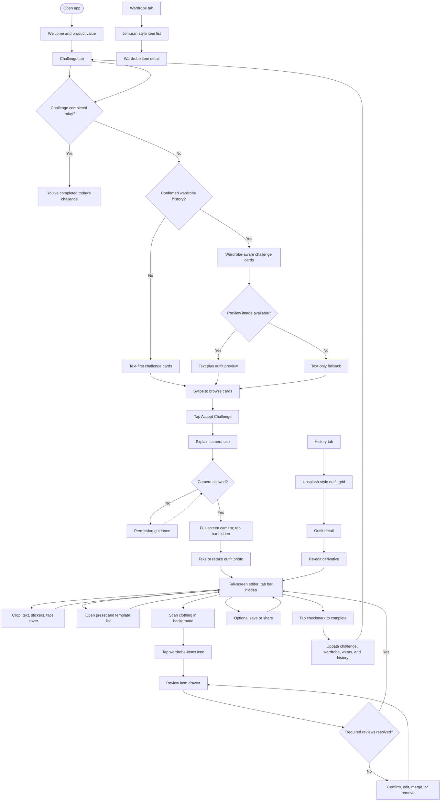

# Wardrobe Challenge App — MVP Product Requirements Document

| Field                   | Value                                                                              |
| ----------------------- | ---------------------------------------------------------------------------------- |
| Status                  | Revised after finalized lo-fi flow                                                 |
| Version                 | 2.0                                                                                |
| Updated                 | 7 August 2026                                                                      |
| Product                 | Wardrobe Challenge App (working title)                                             |
| Platforms               | Swift iOS mobile app; Rust Axum backend; PostgreSQL database                       |
| Primary validation goal | Determine whether daily creative challenges increase reuse of rarely worn clothing |

## 1. Executive summary

The product helps fashion-conscious people in their 20s reuse more clothes they already own through one creative Outfit of the Day challenge per day. A new user can reach the challenge deck immediately after a short welcome screen. They browse a stacked card carousel, explicitly accept one challenge, take a photo, edit it, review AI-detected clothing, and complete the challenge.

The wardrobe grows progressively from completed challenge photos. Gallery-import onboarding is intentionally deprioritized from the MVP. When the app lacks wardrobe history, challenge cards use approachable text such as “Today is a good day to wear …”. When confirmed wardrobe items are available, the app prioritizes rarely worn pieces and may show an outfit preview based on those items. A missing preview image must never block a text-only challenge.

The primary navigation has three tabs: **Challenge**, **Wardrobe**, and **History**. Camera and editor steps are full-screen and hide the tab bar. After completing one challenge, Challenge shows “You’ve completed today’s challenge” until the next daily reset.

The product must remain creative, low-friction, non-judgmental, private by default, and resilient to imperfect AI. Users confirm consequential wardrobe changes; sharing is optional and separate from challenge completion.

## 2. Background and evidence

The available interview evidence is limited to these findings:

- Low prices reduce hesitation about buying multiple thrifted or inexpensive clothing items.
- Users want to make better use of their existing wardrobes.
- Users often lack motivation to style rarely worn clothing.
- Photographing and cataloguing every garment creates too much friction.
- People in their 20s respond better to engaging, challenge-based experiences than information-heavy sustainability products.

The finalized lo-fi contributes product and interaction decisions, not new user-research evidence. Market size, willingness to pay, ideal challenge quantity, preferred reset time, acceptable editing depth, recommendation-image value, and purchase-frequency change remain unvalidated.

## 3. Problem statement

Fashion-conscious people in their 20s can accumulate inexpensive or thrifted clothing faster than they reuse it. They want to shop more intentionally and wear more of what they own, but overlooked pieces are easy to forget and traditional digital closet setup feels like work. The product must make wardrobe creation a by-product of a fun daily outfit experience rather than a prerequisite for receiving value.

## 4. Product vision and principles

### Vision

Make rediscovering an existing wardrobe as visually rewarding and creatively motivating as finding something new to buy.

### Principles

1. **Create value before building the wardrobe:** A first-time user can choose a challenge before having wardrobe history.
2. **Progressive wardrobe creation:** Confirmed challenge photos add or update items over time; full upfront cataloguing is unnecessary.
3. **AI assists; users decide:** AI proposes items, attributes, matches, duplicates, and recommendations, but users confirm consequential changes.
4. **Creative rather than judgmental:** Prompts invite experimentation and never shame users for purchases or unworn items.
5. **Text must stand alone:** Recommendation imagery enhances a challenge but is never required to understand or accept it.
6. **Sharing stays optional:** A user can complete the full loop privately without saving or sharing externally.

## 5. Target audience and primary persona

### Primary audience

A fashion-conscious person in their 20s who regularly buys inexpensive or thrifted clothing, owns liked but rarely worn items, enjoys Outfit of the Day content, wants to shop more intentionally, and does not want to catalogue an entire wardrobe manually.

### Operational persona

**The Creative Rewearer**

- **Goal:** Find a fresh reason to style clothes they already own.
- **Current behavior:** Takes outfit photos, consumes visual fashion content, and makes low-friction clothing purchases.
- **Barrier:** Wardrobe organisation feels like setup work; overlooked items are out of mind.
- **Motivator:** A specific daily prompt, a polished photo, and visible outfit history.
- **Trust need:** Control over camera access, AI corrections, wardrobe identity, photo editing, and sharing.

This persona is a synthesis of the supplied target definition, not an additional research finding.

## 6. Jobs to be done

1. **When I want inspiration for today’s outfit,** give me several lightweight challenge options, **so I can choose one that feels exciting.**
2. **When I finish styling the challenge,** help me capture and personalize the outfit, **so the result feels worth keeping.**
3. **When the app detects my clothes,** let me review uncertain or new items without leaving the creative flow, **so my wardrobe becomes trustworthy over time.**
4. **When I return later,** help me find clothes and past outfits visually, **so I can rediscover what I own and how I styled it.**

## 7. User needs and pain points

| User need                        | Current pain                                        | MVP response                                                               |
| -------------------------------- | --------------------------------------------------- | -------------------------------------------------------------------------- |
| Reach value immediately          | Upfront wardrobe setup delays the fun               | Welcome goes directly to a usable text-first challenge deck                |
| Choose rather than be told       | A single recommendation may not fit mood or context | Swipeable stack with several options and explicit acceptance               |
| Keep creativity central          | Data review can interrupt editing                   | AI item review lives in a collapsible drawer inside the editor             |
| Build a wardrobe with low effort | Garment-by-garment capture is too much work         | Completed challenge photos progressively create and update items           |
| Rediscover items visually        | Conventional grids can feel utilitarian             | “Jemuran”-inspired wardrobe presentation with search, filters, and sort    |
| Revisit outfit memories          | Lists underplay visual content                      | Unsplash-style history grid with detail and re-editing                     |
| Maintain control                 | AI and photo access can feel invasive               | Contextual consent, corrections, non-destructive editing, optional sharing |

## 8. Product hypothesis

**If users receive enjoyable daily styling challenges that increasingly feature rarely worn wardrobe items, then they will reuse more of their wardrobe and reduce the frequency or quantity of impulsive clothing purchases.**

The MVP directly tests challenge selection, completion, and confirmed wardrobe reuse. Purchase-frequency change is a lagging, self-reported outcome and must not be inferred from engagement alone.

## 9. Core product loop

1. A new user sees the product value and continues to Challenge.
2. The app presents several daily challenge cards in a stacked carousel.
3. With no history, cards are understandable as text-only prompts.
4. With confirmed wardrobe data, the app prioritizes rarely worn items and may add a wardrobe-based outfit preview.
5. The user swipes to browse and taps **Accept Challenge** on one card.
6. The full-screen camera requests permission contextually and the user takes a photo.
7. The full-screen editor offers crop, text, stickers, face cover, and a small template/preset collection.
8. AI scans clothing while the user edits; an item icon opens a collapsible review drawer.
9. The user confirms or corrects new, uncertain, or possible duplicate items.
10. The user may save or share the edited image.
11. The user taps the checkmark to complete; the app atomically updates the challenge, history, items, and wear records.
12. Challenge shows the completed-today state; Wardrobe and History now reflect the outfit.

## 10. MVP user flow

This flow replaces gallery-import onboarding as the MVP source of truth.

### Flow clarifications

- Horizontal swipes browse cards only; they do not accept, reject, or permanently dismiss a challenge.
- Acceptance requires an explicit button.
- An accepted challenge remains active if the user leaves the camera or editor. The user may resume or abandon it before completion.
- The tab bar is hidden on camera and editor screens to preserve focus and screen space.
- Saving or sharing does not complete the challenge. Only the checkmark commits completion.
- After completion, no challenge cards appear again until the daily reset.

## 11. User-flow exceptions and recovery paths

| Exception                             | Required behavior                                                               | Recovery outcome                                                                            |
| ------------------------------------- | ------------------------------------------------------------------------------- | ------------------------------------------------------------------------------------------- |
| No wardrobe history                   | Present complete text-only prompts; do not show an empty-image placeholder      | User can accept a first challenge immediately                                               |
| Wardrobe item imagery is insufficient | Keep the same challenge text and omit the preview image                         | Recommendation remains understandable and actionable                                        |
| Challenge deck fails to load          | Show a retry and preserve the daily state; do not fabricate completion          | User retries without restarting onboarding                                                  |
| Accepted challenge is exited          | Persist its status and draft photo/edit state when available                    | User resumes or explicitly abandons it                                                      |
| Camera access denied                  | Explain why capture is needed and how to enable it in iOS settings              | User retries permission or returns to Challenge                                             |
| Photo capture fails                   | Keep the active challenge and show the failed operation                         | User retakes without losing the challenge                                                   |
| Clothing scan is loading              | Keep editing available; item icon shows progress                                | User continues editing and reviews items when ready                                         |
| No garment is detected                | Explain the limitation and offer retake or explicit manual item entry           | User resolves wardrobe review without automatic challenge failure                           |
| Detection is uncertain                | Mark the affected fields clearly in the item drawer                             | User confirms, edits, or removes the candidate                                              |
| Possible duplicate                    | Show both candidates and history; never merge automatically                     | User merges, rejects, or defers                                                             |
| Editor, upload, or API fails          | Preserve the original photo and local draft where possible                      | User retries safely; no duplicate completion or wear record                                 |
| Save/share fails                      | Keep the edited preview and state whether challenge completion is still pending | User retries or completes without sharing                                                   |
| Completion succeeds but refresh fails | Treat completion as committed and show a retryable refresh state                | User never has to complete the same challenge twice                                         |
| Daily reset occurs during editing     | Allow the already accepted challenge to finish once                             | Completion is attributed to the acceptance day and no second challenge unlocks accidentally |

## 12. Information architecture and navigation

The finalized three-tab navigation is sufficient for MVP.

| Destination   | Purpose                                     | Primary content                                                    |
| ------------- | ------------------------------------------- | ------------------------------------------------------------------ |
| **Challenge** | Choose, resume, or finish today’s challenge | Stacked card deck, active challenge, completed-today state         |
| **Wardrobe**  | Find and inspect detected clothing          | “Jemuran”-inspired visual list, search, filters, sort, item detail |
| **History**   | Revisit and re-edit completed outfits       | Unsplash-style image grid, search, filters, sort, outfit detail    |

Settings, camera/photo permissions, privacy controls, and deletion controls remain behind a profile entry instead of occupying a fourth tab.

### Visual direction

- **Wardrobe:** Use the supplied “jemuran” reference as a directional metaphor: clothing appears visually hung or clipped across horizontal lines. Preserve scannability, item labels, touch targets, and accessibility. Use original product assets; do not reproduce the Pinterest artwork, typography, or decorative composition.
- **History:** Use a dense, image-led masonry or adaptive grid inspired by Unsplash. Stable ordering and predictable touch targets take priority over decorative irregularity.

## 13. MVP scope

### 13.1 Confirmed product decisions

| #   | Default decision                                                                                                                           | Reason                                                             | Main trade-off                                        | Evidence needed                             | Change when                                                             |
| --- | ------------------------------------------------------------------------------------------------------------------------------------------ | ------------------------------------------------------------------ | ----------------------------------------------------- | ------------------------------------------- | ----------------------------------------------------------------------- |
| 1   | Welcome continues directly to Challenge; no gallery-import setup                                                                           | Reaches value before asking users to build data                    | First recommendations cannot be personalized          | First-session acceptance/completion         | Generic prompts fail to create first-session value                      |
| 2   | One completed challenge per user-local calendar day                                                                                        | Creates a clear, lightweight habit                                 | Users cannot complete multiple prompts when motivated | Completion frequency and requests for more  | Additional attempts improve retention without fatigue                   |
| 3   | Present several daily cards; swipes browse and an explicit button accepts                                                                  | Supports choice without ambiguous Tinder-style commitment          | Requires an extra tap                                 | Browse depth, acceptance time, mis-taps     | Users strongly expect swipe-right acceptance after testing              |
| 4   | With no history, use text such as “Today is a good day to wear …”                                                                          | Works with zero wardrobe data                                      | Prompts may feel generic                              | First-user acceptance and prompt ratings    | Category/color prompts are still too vague                              |
| 5   | With history, prioritize rarely worn confirmed items and show their imagery when suitable                                                  | Connects the daily experience to wardrobe reuse                    | Item data and imagery may be incomplete               | Acceptance, reuse, image coverage           | Other recommendation logic performs better                              |
| 6   | MVP preview images are simple compositions of owned-item reference crops; no generative try-on                                             | Meets the visual intent with bounded technical and trust risk      | Does not depict a person wearing the combination      | Preview usefulness and comprehension        | Users need styled-on-body inspiration and its safety/cost are validated |
| 7   | Text-only is the permanent fallback when a useful preview cannot be produced                                                               | Prevents image scarcity from blocking the core loop                | Inconsistent card richness                            | Acceptance with/without previews            | Consistency matters more than optional imagery                          |
| 8   | Request camera permission only after challenge acceptance and a short explanation                                                          | Permission is contextual and easier to understand                  | Adds a step before capture                            | Permission grant and return rates           | Earlier education measurably improves trust                             |
| 9   | AI item review opens from a persistent icon into a collapsible bottom sheet/drawer                                                         | Keeps editing central while making wardrobe data available         | Some users may miss the drawer                        | Drawer discovery and unresolved-review rate | Inline review proves clearer without harming editing                    |
| 10  | Require resolution of new, uncertain, and duplicate items before completion; existing high-confidence matches receive one-tap confirmation | Protects wardrobe identity and wear history                        | Adds completion effort                                | Review time, corrections, abandonment       | The gate becomes the main source of incomplete challenges               |
| 11  | MVP editor includes crop, text, stickers, face cover, and a small preset/template collection                                               | Delivers the lo-fi’s creative value without a full editor platform | Fewer creative options than CapCut/Canva              | Tool use and share intent                   | Users avoid keeping/sharing results due to missing tools                |
| 12  | Share/save and completion are independent; only the checkmark completes                                                                    | Preserves optional sharing and explicit commitment                 | Two actions can be confused                           | Mis-taps and uncompleted shared photos      | Testing shows a clearer combined confirmation is needed                 |
| 13  | Wardrobe uses the “jemuran” metaphor; History uses an image-led grid                                                                       | Gives each collection a distinct, memorable purpose                | Custom layouts cost more than standard lists          | Findability, performance, accessibility     | The metaphor reduces discovery or accessibility                         |

### 13.2 In-scope outcomes

- A first-time user can accept and complete a text-first challenge without an existing wardrobe.
- A returning user can receive rarely worn-item challenges with optional wardrobe-based previews.
- A completed outfit progressively creates or updates confirmed wardrobe items and wear history.
- A user can edit the photo without losing control of AI-detected item data.
- A user can find items and outfit history through visual collections, search, filters, and sort.
- A user can re-edit an outfit derivative and optionally save/share it again.

## 14. Functional requirements

Priority meanings: **Must** is required for launch, **Should** is expected unless delivery evidence forces a cut, **Could** is the first removable scope, and **Won’t** is excluded from MVP.

### 14.1 Onboarding and navigation

| ID     | Priority | Story                  | Flow step       | Requirement and observable acceptance criteria                                                               | Error or recovery behavior                                                               |
| ------ | -------- | ---------------------- | --------------- | ------------------------------------------------------------------------------------------------------------ | ---------------------------------------------------------------------------------------- |
| FR-001 | Must     | US-001                 | Welcome         | Explain the daily creative-challenge value without requesting camera or gallery access.                      | Interrupted onboarding resumes at Welcome without losing product state.                  |
| FR-002 | Must     | US-001                 | Continue        | Continue directly to Challenge and mark onboarding complete.                                                 | A failed state fetch opens Challenge with a retryable loading state, not a setup wizard. |
| FR-003 | Must     | US-001                 | Main navigation | Provide exactly three primary tabs: Challenge, Wardrobe, and History.                                        | Preserve the selected tab across ordinary app background/foreground cycles.              |
| FR-004 | Must     | US-001, US-004, US-005 | Camera/editor   | Hide the tab bar on camera and editor screens; back/cancel behavior is explicit.                             | Leaving preserves the active challenge and any safely persisted draft.                   |
| FR-005 | Must     | US-012                 | Profile/privacy | Provide permission status, privacy notice, photo deletion, and account/data deletion behind a profile entry. | Failed deletion is never reported as complete and can be retried safely.                 |

### 14.2 Daily challenge discovery

| ID     | Priority | Story          | Flow step             | Requirement and observable acceptance criteria                                                                                          | Error or recovery behavior                                                                                   |
| ------ | -------- | -------------- | --------------------- | --------------------------------------------------------------------------------------------------------------------------------------- | ------------------------------------------------------------------------------------------------------------ |
| FR-006 | Must     | US-002         | Challenge deck        | For each eligible day, provide a bounded list of challenge cards with unique IDs and understandable text.                               | Deck failure shows retry; the server does not silently replace an accepted/completed daily state.            |
| FR-007 | Must     | US-002         | Browse cards          | Present cards as a stacked carousel. Left/right swipes move between options but do not accept, reject, or permanently dismiss them.     | Provide visible buttons and VoiceOver actions as non-swipe alternatives.                                     |
| FR-008 | Must     | US-002         | No history            | When no confirmed wardrobe item exists, show text-first prompts such as “Today is a good day to wear [prompt].”                         | Never display broken, empty, or mandatory image containers.                                                  |
| FR-009 | Must     | US-002         | Wardrobe-aware cards  | When history exists, prioritize eligible rarely worn items using confirmed wear data and identify the referenced item in the card text. | If no eligible item exists, use a general or user-choice prompt without claiming rarity.                     |
| FR-010 | Should   | US-002         | Preview image         | When suitable item reference crops exist, display a simple outfit composition based on the recommended owned items.                     | If composition fails or coverage is insufficient, render the same card as text-only.                         |
| FR-011 | Must     | US-003         | Accept                | Accept a challenge only through an explicit action; persist one active challenge and its source recommendation.                         | Repeated acceptance is idempotent; accepting another requires explicit abandonment of the current challenge. |
| FR-012 | Must     | US-003, US-007 | Completed-today state | After one successful daily completion, replace the deck with “You’ve completed today’s challenge” until the user-local daily reset.     | Clock/time-zone changes cannot create duplicate eligible completions; show a clear next reset state.         |

### 14.3 Camera and capture

| ID     | Priority | Story          | Flow step          | Requirement and observable acceptance criteria                                                                              | Error or recovery behavior                                                        |
| ------ | -------- | -------------- | ------------------ | --------------------------------------------------------------------------------------------------------------------------- | --------------------------------------------------------------------------------- |
| FR-013 | Must     | US-004         | Explain camera use | Before the first camera prompt, explain why a photo is needed, how it is processed, retained, and that sharing is optional. | Without consent, no capture or upload occurs; active challenge remains available. |
| FR-014 | Must     | US-004         | Camera permission  | Support granted, denied, restricted, and revoked camera states.                                                             | Denial shows settings guidance and a safe return to the active challenge.         |
| FR-015 | Must     | US-004         | Camera             | Open a full-screen camera from the accepted challenge with the tab bar hidden.                                              | Initialization failure names the issue and preserves the active challenge.        |
| FR-016 | Must     | US-004         | Capture            | Let users capture, preview, retake, or use the accepted image.                                                              | Failed capture retains camera state and does not create a photo record.           |
| FR-017 | Must     | US-003, US-004 | Resume/abandon     | Persist an accepted challenge across navigation/app interruption and allow explicit abandonment before completion.          | Confirm abandonment when a photo/edit draft would be discarded.                   |

### 14.4 Editor and AI item review

| ID     | Priority | Story          | Flow step            | Requirement and observable acceptance criteria                                                                                                                                | Error or recovery behavior                                                                   |
| ------ | -------- | -------------- | -------------------- | ----------------------------------------------------------------------------------------------------------------------------------------------------------------------------- | -------------------------------------------------------------------------------------------- |
| FR-018 | Must     | US-005         | Editor               | Open the accepted photo in a full-screen, non-destructive editor.                                                                                                             | Loading failure preserves the original capture and supports retry.                           |
| FR-019 | Must     | US-005         | Editing tools        | Provide crop, plain text, a small sticker set, and opaque face-cover options.                                                                                                 | Cancelling a tool restores the last committed edit state; the original remains unchanged.    |
| FR-020 | Should   | US-005         | Presets/templates    | Provide a discoverable button for a small curated list of presets/templates that can be previewed and removed.                                                                | Unavailable assets do not block manual editing or completion.                                |
| FR-021 | Must     | US-006         | Clothing scan        | Start garment scanning after capture without blocking the basic editor; show scan progress on the item icon.                                                                  | Retry transient failure; if still unavailable, offer retake or manual item entry.            |
| FR-022 | Must     | US-006         | Item drawer          | A persistent wardrobe-items icon opens a collapsible drawer without permanently covering the editor.                                                                          | The drawer restores the user’s prior expanded/collapsed state during the session.            |
| FR-023 | Must     | US-006         | Detected item fields | For each candidate show image reference, name, color, category, type, confidence, and—when previously confirmed—use count, first-recorded-use date, and last-used date.       | Missing prior history is labeled “New item”; never fabricate zero-confidence dates.          |
| FR-024 | Must     | US-006         | Confirm/correct      | Let users rename, recolor, recategorize, change type, remove, or manually add a garment. Confirmed input overrides AI suggestions.                                            | Invalid required fields identify the affected item and preserve other edits.                 |
| FR-025 | Must     | US-006         | Existing-item match  | Suggest matches to existing wardrobe items and show enough reference/history for confirmation.                                                                                | Low confidence defaults to unresolved; it cannot silently increment an existing item.        |
| FR-026 | Must     | US-006         | Duplicate resolution | Suggest possible duplicates and let users merge, reject, or defer; never merge automatically.                                                                                 | Merge preserves confirmed wear history and can be cancelled before commit.                   |
| FR-027 | Must     | US-006, US-007 | Review gate          | Before completion, require all new, uncertain, and duplicate candidates to be resolved or explicitly excluded; existing high-confidence matches require one-tap confirmation. | Checkmark explains unresolved work and opens the relevant item rather than failing silently. |

### 14.5 Completion, saving, and sharing

| ID     | Priority | Story  | Flow step  | Requirement and observable acceptance criteria                                                                                                     | Error or recovery behavior                                                                |
| ------ | -------- | ------ | ---------- | -------------------------------------------------------------------------------------------------------------------------------------------------- | ----------------------------------------------------------------------------------------- |
| FR-028 | Must     | US-007 | Complete   | The checkmark is the only action that completes the daily challenge.                                                                               | If item review is unresolved, completion is blocked with an actionable explanation.       |
| FR-029 | Must     | US-007 | Commit     | Atomically create one challenge completion, one history entry, confirmed item changes, and one wear record per confirmed item for the outfit date. | Repeated taps/retries return the same result and cannot duplicate wears.                  |
| FR-030 | Must     | US-007 | Redirect   | After commit, return to Challenge and show the completed-today state.                                                                              | If refresh fails, show completion as saved with retry; never reopen the deck incorrectly. |
| FR-031 | Must     | US-008 | Save/share | Provide optional Save and standard iOS Share actions independently of completion.                                                                  | Save/share failure preserves editor state and does not change completion state.           |
| FR-032 | Must     | US-008 | Export     | Preview and export only a flattened derivative with source metadata and private wardrobe fields excluded by default.                               | Rendering failure retains edits for retry; original photo is unchanged.                   |

### 14.6 Wardrobe browsing

| ID     | Priority | Story  | Flow step             | Requirement and observable acceptance criteria                                                                                                  | Error or recovery behavior                                                              |
| ------ | -------- | ------ | --------------------- | ----------------------------------------------------------------------------------------------------------------------------------------------- | --------------------------------------------------------------------------------------- |
| FR-033 | Must     | US-009 | Wardrobe list         | Show confirmed items created from completed challenge photos in a “jemuran”-inspired vertically scrollable layout.                              | Empty state explains that completing the first challenge creates wardrobe items.        |
| FR-034 | Must     | US-009 | Search                | Search confirmed items by normalized name, color, category, and type.                                                                           | No-results state exposes clear-query/filter and return actions.                         |
| FR-035 | Must     | US-009 | Filter/sort           | Filter by category, color, usage status, and personal label; sort alphabetically, recently used, least used, most used, or recently added.      | Active controls remain visible and can be reset in one action.                          |
| FR-036 | Must     | US-010 | Item detail           | Show item reference, editable attributes, use count, first-recorded-use date, last-used date, wear timeline, usage status, and personal labels. | Missing history is explicit; failed edits preserve the last confirmed state.            |
| FR-037 | Must     | US-010 | Personal/usage labels | Keep user-controlled `favorite` and `must-have` independent from history-derived `go-to` and `rarely worn`.                                     | Insufficient history produces no derived status rather than an invented classification. |

### 14.7 History browsing and re-editing

| ID     | Priority | Story  | Flow step          | Requirement and observable acceptance criteria                                                                                              | Error or recovery behavior                                                                                   |
| ------ | -------- | ------ | ------------------ | ------------------------------------------------------------------------------------------------------------------------------------------- | ------------------------------------------------------------------------------------------------------------ |
| FR-038 | Must     | US-011 | History grid       | Show one entry per completed challenge in an image-led adaptive/masonry grid ordered newest first by default.                               | Empty state routes to Challenge; failed thumbnails use accessible placeholders.                              |
| FR-039 | Must     | US-011 | Search/filter/sort | Search by challenge text and confirmed item attributes; filter by date, challenge, category, and item; sort newest or oldest.               | Search analytics excludes raw query text; controls reset in one action.                                      |
| FR-040 | Must     | US-011 | History detail     | On item tap, show the full edited photo, challenge text/date, and confirmed wardrobe items used.                                            | Deleted media displays a placeholder while accurately reflecting retained history under the deletion policy. |
| FR-041 | Should   | US-011 | Re-edit            | Reopen a non-destructive derivative in the editor and save a new presentation version without changing challenge completion or wear counts. | Failed save retains the last published derivative and the in-progress draft.                                 |
| FR-042 | Must     | US-011 | Re-share           | Allow saved derivatives to be previewed, saved, or shared again.                                                                            | Re-sharing never creates a second challenge completion or wear record.                                       |

## 15. User stories with acceptance criteria

### US-001 — Reach the product value quickly

**As a new fashion user, I want to continue from Welcome directly to today’s challenges, so that I can understand the product through action rather than setup.**

- **User-flow stage:** Welcome and navigation
- **Priority:** Must
- **Preconditions:** Fresh install or onboarding incomplete
- **Trigger:** User opens the app and taps Continue
- **Main success path:** Welcome → Continue → Challenge deck
- **Alternate/failure paths:** Interrupted onboarding; challenge state loading failure
- **Acceptance criteria:** Given a fresh install, when Continue is tapped, then Challenge opens without gallery or camera permission. Exactly three primary tabs are available. Camera/editor later hide the tab bar.
- **Related analytics:** `welcome_continued`, `primary_tab_viewed`

### US-002 — Browse and choose a daily prompt

**As a user deciding what to wear, I want several challenge options, so that I can choose one that fits today.**

- **User-flow stage:** Daily challenge discovery
- **Priority:** Must
- **Preconditions:** No completion exists for the current user-local day
- **Trigger:** User opens Challenge
- **Main success path:** View card → swipe through options → inspect text/optional preview → select one
- **Alternate/failure paths:** Text-only deck; missing preview; deck retry; VoiceOver/button navigation
- **Acceptance criteria:** Swipes browse without accepting or dismissing. Every card is understandable without an image. With eligible history, rarely worn items are prioritized and any preview uses confirmed wardrobe references.
- **Related analytics:** `challenge_deck_loaded`, `challenge_card_browsed`

### US-003 — Accept, resume, or abandon a challenge

**As a user who chose a prompt, I want explicit control over its active state, so that an accidental gesture does not commit me.**

- **User-flow stage:** Challenge acceptance
- **Priority:** Must
- **Preconditions:** Eligible daily deck exists
- **Trigger:** User taps Accept Challenge
- **Main success path:** Accept → active challenge → camera
- **Alternate/failure paths:** Exit and resume; abandon with confirmation; repeated accept
- **Acceptance criteria:** Only the explicit button accepts. One active challenge is persisted. A repeated request is idempotent. Abandonment is confirmed when draft work would be lost.
- **Related analytics:** `challenge_accepted`, `active_challenge_resolved`

### US-004 — Capture the challenge outfit

**As a user who styled the prompt, I want to take and retake a photo, so that I can choose a result I like.**

- **User-flow stage:** Camera
- **Priority:** Must
- **Preconditions:** Active challenge exists
- **Trigger:** Camera opens
- **Main success path:** Privacy context → permission → capture → preview → use photo
- **Alternate/failure paths:** Denied/revoked permission; initialization failure; retake; return to challenge
- **Acceptance criteria:** Permission is requested contextually. The tab bar is hidden. Failed or cancelled capture does not remove the active challenge or create a photo record.
- **Related analytics:** `camera_permission_result`, `outfit_capture_completed`

### US-005 — Personalize the outfit photo

**As a creative user, I want lightweight story-style editing, so that the photo feels personal without becoming a design project.**

- **User-flow stage:** Editor
- **Priority:** Must
- **Preconditions:** Captured photo accepted
- **Trigger:** Editor opens
- **Main success path:** Crop/add text/stickers/face cover → optionally apply preset/template → preview
- **Alternate/failure paths:** Skip tools; remove preset; cancel tool; asset/render failure
- **Acceptance criteria:** Edits are non-destructive. Core tools work without templates. The user can reach completion without editing or sharing.
- **Related analytics:** `editor_session_completed`, `template_applied`

### US-006 — Review automatically detected wardrobe items

**As a user editing my outfit, I want to review detected clothing in a non-blocking drawer, so that my wardrobe grows accurately without interrupting creativity.**

- **User-flow stage:** AI item review
- **Priority:** Must
- **Preconditions:** Captured photo exists; scan has started
- **Trigger:** User taps the item icon or completion finds unresolved items
- **Main success path:** Open drawer → inspect new/existing items → correct attributes/duplicates → confirm
- **Alternate/failure paths:** Scan loading/failure; no garment; low confidence; manual item; deferred duplicate
- **Acceptance criteria:** New/uncertain/duplicate items are unresolved by default. User corrections override AI. No existing item’s use count changes without confirmation. The drawer can collapse back to the editor.
- **Related analytics:** `item_drawer_opened`, `outfit_item_review_completed`

### US-007 — Complete one daily challenge

**As a challenge participant, I want an explicit completion action and visible daily success state, so that I know my outfit and wardrobe history were saved.**

- **User-flow stage:** Completion
- **Priority:** Must
- **Preconditions:** Active challenge; required item reviews resolved
- **Trigger:** User taps the checkmark
- **Main success path:** Validate → atomic commit → Challenge → completed-today message
- **Alternate/failure paths:** Unresolved item; repeated tap; partial network failure; reset during editing
- **Acceptance criteria:** One challenge, one history entry, and one wear per confirmed item are committed exactly once. The deck remains unavailable until reset. Completion succeeds independently of sharing.
- **Related analytics:** `challenge_completed`

### US-008 — Optionally save or share

**As a user proud of my outfit, I want to save or share the edited result without exposing wardrobe data, so that external participation stays safe and optional.**

- **User-flow stage:** Editor/export
- **Priority:** Must
- **Preconditions:** Edited preview exists
- **Trigger:** User taps Save or Share
- **Main success path:** Preview → save or standard iOS share sheet → return to editor/detail
- **Alternate/failure paths:** Cancel; permission failure; render/share failure
- **Acceptance criteria:** Export is a flattened derivative with source metadata and private fields removed. Saving/sharing never completes or duplicates a challenge.
- **Related analytics:** `share_action_completed`

### US-009 — Find a wardrobe item visually

**As a wardrobe user, I want to browse, search, filter, and sort my clothing, so that I can rediscover items quickly.**

- **User-flow stage:** Wardrobe
- **Priority:** Must
- **Preconditions:** Zero or more confirmed items exist
- **Trigger:** User opens Wardrobe
- **Main success path:** Scan “jemuran” rows → search/filter/sort → select item
- **Alternate/failure paths:** Empty wardrobe; no results; image unavailable
- **Acceptance criteria:** Confirmed items appear once in the visual list. Search covers name/color/category/type. Controls show current state, support reset, and remain operable without relying on drag gestures.
- **Related analytics:** `wardrobe_browsed`, `wardrobe_query_applied`

### US-010 — Understand an item’s use history

**As a user considering a garment, I want its attributes and wear history, so that I can understand how it fits my wardrobe.**

- **User-flow stage:** Wardrobe item detail
- **Priority:** Must
- **Preconditions:** Confirmed item exists
- **Trigger:** User taps an item
- **Main success path:** View/edit attributes → inspect counts/dates/timeline → manage personal labels
- **Alternate/failure paths:** No prior wear beyond creation; save/recompute failure
- **Acceptance criteria:** Use count, first-recorded-use, and last-used values derive only from confirmed wear records. Personal and usage labels remain independent. Missing history is explicit.
- **Related analytics:** `wardrobe_item_viewed`

### US-011 — Revisit and re-edit an outfit

**As a user looking back at completed challenges, I want to find an outfit, see its items, and re-edit it, so that my history remains useful and creative.**

- **User-flow stage:** History
- **Priority:** Must
- **Preconditions:** Zero or more completed challenges exist
- **Trigger:** User opens History or taps an image
- **Main success path:** Browse/search/filter/sort → detail → view used items → optional re-edit/save/share
- **Alternate/failure paths:** Empty state; missing media; re-edit failure
- **Acceptance criteria:** One history entry maps to one completion. Re-editing creates a new derivative version but does not modify completion date or wear counts. Used items link to confirmed wardrobe records.
- **Related analytics:** `history_browsed`, `history_item_opened`, `history_reedit_saved`

### US-012 — Control permissions and personal data

**As a user who gives the app photos, I want to review permissions and delete data, so that I remain in control after onboarding.**

- **User-flow stage:** Profile/privacy
- **Priority:** Must
- **Preconditions:** App installed; local or account data may exist
- **Trigger:** User opens privacy controls
- **Main success path:** Review access → remove photo or request account/data deletion → confirm → completion state
- **Alternate/failure paths:** Cancel; offline; deletion service failure
- **Acceptance criteria:** Destructive actions require confirmation. Failure is never shown as success. Deletion follows the disclosed behavior for derivatives, detections, history, and wear records.
- **Related analytics:** `privacy_control_used` with action category only

## 16. AI and computer-vision behavior

### AI responsibilities and user authority

| AI task                | AI may propose                                      | User authority                                       |
| ---------------------- | --------------------------------------------------- | ---------------------------------------------------- |
| Daily prompt selection | General prompt or rarely worn confirmed item        | Browse, accept, or ignore                            |
| Recommendation preview | Composition of confirmed owned-item reference crops | Treat as inspiration; card remains usable without it |
| Garment detection      | Candidate garment, image region, confidence         | Confirm, remove, or add manually                     |
| Item attributes        | Name, color, category, and type                     | Edit before commit                                   |
| Existing-item match    | Candidate canonical wardrobe item                   | Confirm or reject                                    |
| Duplicate detection    | Possible duplicate pair                             | Merge, reject, or defer; never automatic             |
| Usage status           | `go-to` or `rarely worn` from confirmed wear data   | See rationale and dismiss; no personal-label effect  |

### MVP item data

| Field              | User-visible              | Source and rule                                                                                                              |
| ------------------ | ------------------------- | ---------------------------------------------------------------------------------------------------------------------------- |
| `name`             | Yes                       | AI suggestion; user editable; required                                                                                       |
| `color`            | Yes                       | AI suggestion from controlled vocabulary; user editable; required                                                            |
| `category`         | Yes                       | `top`, `bottom`, `one-piece`, `outerwear`, `footwear`, or `accessory`; assumption to validate                                |
| `type`             | Yes                       | More specific garment type such as `t-shirt`, `pants`, or `hoodie`; user editable                                            |
| `use_count`        | Yes for existing items    | Derived from confirmed wear records only                                                                                     |
| `first_used_date`  | Yes when available        | Earliest confirmed challenge wear date; display as “First recorded use”                                                      |
| `last_used_date`   | Yes when available        | Latest confirmed challenge wear date                                                                                         |
| `confidence_state` | Yes when review is needed | Human-readable `needs review` state; numeric model score stays internal                                                      |
| Internal metadata  | No                        | Canonical item ID, source completion/photo reference, model/version, confidence, crop reference, duplicate state, timestamps |

Do not add speculative metadata to the user interface. New fields require a user or operational decision they support.

### Recommendation behavior

1. With no confirmed items, select from a curated set of text-first prompts that do not claim knowledge of the wardrobe.
2. With confirmed history, prioritize items suggested as rarely worn from confirmed frequency and recency.
3. A preview image is optional. MVP uses owned-item reference crops arranged as a simple composition, not generated on-body imagery or virtual try-on.
4. If any referenced item lacks a suitable crop or composition fails, the card falls back to text without losing its position or accept action.
5. Recommendation text must identify the intended clothing cue and remain understandable without visual content.

### Confidence, correction, and bias

- Calibrate confidence thresholds against a representative validation set before launch; do not expose raw scores as user truth.
- High-confidence existing matches still require one-tap confirmation before a wear is added.
- New, low-confidence, or duplicate candidates require focused review.
- Confirmed user corrections outrank future AI results and cannot be silently reversed.
- Model training on user photos or corrections requires separate explicit consent and is excluded from MVP.
- Validation must include varied lighting, skin tones, body types, garment layering, colors, patterns, cultural clothing, mobility aids, and camera composition. Failure copy must describe system limits without blaming the user or their body/clothing.

## 17. Empty, loading, permission, confidence, and error states

| State                       | Required content                                              | Primary action                         |
| --------------------------- | ------------------------------------------------------------- | -------------------------------------- |
| Welcome                     | Product value and Continue; no premature permission           | Continue to Challenge                  |
| Challenge loading           | Stable skeleton/progress without fake cards                   | Retry or wait                          |
| No wardrobe history         | Complete text-first challenge deck                            | Browse and accept                      |
| Preview unavailable         | Challenge text with no broken-image frame                     | Accept or browse                       |
| Challenge active            | Accepted prompt and resume state                              | Resume camera/editor or abandon        |
| Completed today             | “You’ve completed today’s challenge” and next reset context   | View History or Wardrobe               |
| Camera denied/revoked       | Reason, privacy context, and settings guidance                | Open settings or return                |
| Scan loading                | Progress on item icon while editor stays usable               | Continue editing                       |
| Low confidence              | Identify exact item/fields needing review without color alone | Confirm, edit, remove, or add manually |
| No detection                | Explain that scanning could not find usable clothing          | Retake or enter items manually         |
| Wardrobe empty              | Explain that the first completed challenge creates items      | Go to Challenge                        |
| Wardrobe/history no results | Show active query/filters                                     | Clear controls                         |
| History empty               | Explain that completed outfits appear here                    | Go to Challenge                        |
| Network/service error       | Name failed operation and preserved state                     | Retry safely                           |
| Save/share error            | Keep derivative preview and completion status explicit        | Retry or complete privately            |

All errors must be specific, actionable, and must not silently discard creative work or confirmed data.

## 18. Privacy and data-handling requirements

1. Do not request camera or photo access on Welcome. Request access only at the action that needs it, after a plain-language explanation.
2. Capture or process only the photo the user explicitly takes or selects through an in-scope action. Do not scan the photo library in the background.
3. Before processing, disclose whether scanning occurs on-device or server-side, which media and derivatives are retained, the retention period, service providers, and deletion behavior.
4. Use encrypted transport and encrypted storage for accounts, photos, derivatives, crops, wardrobe items, and wear records. Remote media uses short-lived authorized access.
5. Preserve the original capture separately from non-destructive edit instructions/derivatives; never overwrite the original.
6. Strip source metadata from exports and exclude item names, counts, dates, labels, internal IDs, and account details unless the user deliberately adds public text.
7. Provide deletion for photos, derived crops/exports, and account data. Define and display how deleting a source affects History and wear records.
8. Do not use photos, edits, or corrections for model training without separate explicit consent.
9. Analytics uses pseudonymous identifiers and categorical counts; do not send raw images, crops, free-form item names, editor text, or exact photo timestamps.
10. Restrict and audit administrative access to user media.

## 19. Accessibility requirements

- Support VoiceOver with meaningful headings, card position, challenge text, item fields, editor tools, completion state, and image descriptions where applicable.
- Provide buttons for previous/next challenge; swiping cannot be the only way to browse.
- Support Dynamic Type without hiding acceptance, item review, completion, filter, or search controls.
- Meet WCAG 2.2 AA contrast for product-controlled content and never communicate confidence, selection, or completion by color alone.
- Provide touch targets of at least 44 × 44 points and alternatives to precision gestures.
- Respect Reduce Motion; stacked-card animation and transitions cannot be required to understand state.
- Make crop, text, stickers, face cover, presets, item drawer, and “jemuran” item selection operable with assistive technologies.
- Offer a standard list representation to accessibility technologies even when Wardrobe is visually arranged as hanging items.
- Use plain, non-judgmental copy and avoid gendering garments unless the user supplies that category.

## 20. Non-functional requirements

| Area               | Requirement                                                                                                                                                                                                                                           |
| ------------------ | ----------------------------------------------------------------------------------------------------------------------------------------------------------------------------------------------------------------------------------------------------- |
| Architecture       | Swift iOS client; Rust Axum JSON API; PostgreSQL transactional system of record. CV inference and media-storage choices remain open dependencies.                                                                                                     |
| Reliability        | Challenge acceptance/completion and wear creation are idempotent. Completion commits challenge, history, item changes, and wear records transactionally.                                                                                              |
| Offline resilience | Active challenge, capture, and editor instructions persist locally through ordinary interruption; server-dependent operations show explicit pending/retry state.                                                                                      |
| Performance        | Non-inference API p95 target ≤500 ms under pilot load. Challenge text renders within 2 seconds p95 on a supported connection. Clothing scan shows progress immediately and completes within 20 seconds p95 for one photo. Targets require validation. |
| Media performance  | Wardrobe and History use thumbnails, progressive loading, caching, and bounded memory so image-heavy scrolling remains responsive.                                                                                                                    |
| Stability          | Pilot target ≥99.5% crash-free sessions and no unresolved severity-0 or severity-1 defects.                                                                                                                                                           |
| Security           | TLS, encryption at rest, least privilege, managed secrets, rate limiting, input validation, signed media access, and auditable administrative access.                                                                                                 |
| Data integrity     | Merges, deletions, re-edits, and date changes preserve referential integrity and traceable user confirmation. Re-editing never changes wear counts.                                                                                                   |
| Observability      | Structured logs, request correlation, latency/error metrics, job outcomes, and alerts exclude raw media and private/free-form content.                                                                                                                |
| Compatibility      | MVP targets iPhone portrait. Exact minimum iOS version is an engineering decision that must support required camera, editor, sharing, and accessibility capabilities.                                                                                 |
| Scalability        | Pilot supports asynchronous image processing and safe retry. No bespoke generative-image platform, multi-region system, or real-time social infrastructure is required.                                                                               |

## 21. MVP exclusions and non-goals

- No gallery-import onboarding, bulk photo backfill, or background photo-library scan.
- No requirement to create a wardrobe before the first challenge.
- No full CapCut/Canva-grade editor, video editing, arbitrary layers, creator marketplace, or unlimited template system.
- No generative virtual try-on or generated image of a person wearing the outfit; previews use simple owned-item compositions.
- No automatic duplicate merge, irreversible AI edit, or hidden item-history update.
- No more than one completed daily challenge; no competitive leaderboard.
- No social feed, reactions, follower graph, community inspiration, or required public profile.
- No calendar, weather, seasonal, FIFO, event-based, or shopping recommendations.
- No purchase blocking, no-buy enforcement, donation prompting, or guilt-based sustainability education.
- No monetization, Android, iPad-specific design, or web client in the validation MVP.

## 22. Phase 2 and Phase 3 roadmap

Roadmap progression depends on reliable daily completion, trustworthy item identity, and evidence of repeated wardrobe reuse.

### Phase 2 — Improve wardrobe depth, discovery, and motivation

- **Wardrobe backfill:** Selected gallery-photo import with privacy explanation, capture-date review, batch detection, and correction.
- **Outfit discovery:** Pinterest-style archive options, category galleries, every outfit containing an item, advanced search, and color/mix-and-match suggestions.
- **Creative tools:** More presets, templates, stickers, quotes, and scrapbook controls based on observed use.
- **Motivation:** Transparent frequency/recency scores, challenge difficulty, weekly summaries, opt-in no-buy streak, badges, and unlockables.
- **Recommendation visuals:** Test richer outfit compositions only if the simple preview adds measurable value.

### Phase 3 — Add context, wardrobe decisions, and optional community

- **Contextual recommendations:** Calendar-event, weather, seasonal, first-in/first-out rotation, and best-existing-item suggestions.
- **Wardrobe decisions:** Donation reminders, notes about why an item is not worn, clothing-care instructions, confidence/mood tracking, and optional sustainability information.
- **Social expansion:** Outfit reactions, community inspiration, additional sharing formats, and a dress-up avatar.

Social features require moderation, safety, privacy, abuse, and age-policy work before commitment.

## 23. Primary and supporting success metrics

### Primary metric

**Weekly rare-item challenge completion rate**

`Unique weekly active users who complete at least one challenge targeting a self-identified or history-derived rarely worn item ÷ unique weekly active users`

The challenge’s selection mode and item status are snapshotted at acceptance. Cold-start general challenges do not count in the numerator, but their completion builds the history required for later eligibility.

### Supporting metrics

| Metric                           | Definition                                                                                                 | Why it matters                        | MVP directional target                  |
| -------------------------------- | ---------------------------------------------------------------------------------------------------------- | ------------------------------------- | --------------------------------------- |
| Welcome-to-Challenge rate        | New users reaching Challenge ÷ users viewing Welcome                                                       | Detects onboarding friction           | ≥90% in pilot                           |
| First challenge acceptance       | New users accepting a card in session one ÷ new users reaching an eligible deck                            | Tests text-first value                | ≥60%                                    |
| Accepted-to-capture rate         | Accepted challenges with a usable photo ÷ challenges accepted                                              | Detects permission/camera friction    | ≥70%                                    |
| Challenge completion rate        | Challenges completed by daily expiry ÷ challenges accepted                                                 | Tests full-loop viability             | ≥50%                                    |
| First wardrobe creation rate     | New users confirming ≥1 item through a completed challenge within 7 days ÷ new users accepting a challenge | Tests progressive wardrobe creation   | ≥60%                                    |
| Time to first completion         | Median active time from first deck view to committed challenge                                             | Measures flow friction                | Baseline; target after prototype timing |
| Item correction rate             | Confirmed item candidates with user edits ÷ confirmed candidates                                           | Diagnoses AI burden                   | Investigate if >40% overall             |
| Existing-item match confirmation | Confirmed existing matches ÷ resolved existing-match suggestions                                           | Tests wardrobe continuity             | ≥70% before relying on reuse metrics    |
| Preview coverage                 | Wardrobe-aware cards with usable preview ÷ wardrobe-aware cards shown                                      | Monitors optional visual availability | Observe; no launch gate                 |
| Preview acceptance lift          | Acceptance rate with preview minus comparable text-only acceptance                                         | Tests whether images add value        | Directional; no launch gate             |
| Distinct existing items reused   | Median distinct previously confirmed items worn again per retained user over 4 weeks                       | Direct reuse outcome                  | Increase cohort over cohort             |
| Weekly challenge retention       | Week-N completers completing again in week N+1 ÷ week-N completers                                         | Tests habit formation                 | ≥30% in pilot                           |
| Save/share rate                  | Completions followed by save/share ÷ completions                                                           | Explains creative value; not required | Observe only                            |
| Self-reported purchase change    | Change in purchases over the prior 30 days from baseline to week 4                                         | Tests lagging hypothesis              | Directional; no causal claim            |

Targets are proposed pilot assumptions, not research findings. Segment model-quality metrics by confidence, garment category, lighting/composition cohort, and relevant fairness cohorts only when privacy-safe and statistically responsible.

## 24. Suggested analytics events

| Event name                     | Trigger                                       | Required properties                                                                                                                         | User-flow stage  | Metric supported                      | Privacy considerations                                 |
| ------------------------------ | --------------------------------------------- | ------------------------------------------------------------------------------------------------------------------------------------------- | ---------------- | ------------------------------------- | ------------------------------------------------------ |
| `welcome_continued`            | User taps Continue                            | `elapsed_bucket`, `app_version`                                                                                                             | Welcome          | Welcome-to-Challenge                  | No identity/content fields beyond pseudonymous user ID |
| `challenge_deck_loaded`        | Eligible deck renders                         | `card_count`, `history_eligible`, `completed_today`, `load_latency_bucket`                                                                  | Discovery        | Funnel availability                   | No challenge text or item identity                     |
| `challenge_card_browsed`       | User changes visible card                     | `position`, `direction`, `has_preview`, `selection_mode`                                                                                    | Discovery        | Choice behavior, preview lift         | No image, prompt text, or item ID                      |
| `challenge_accepted`           | Explicit accept commits                       | `position`, `has_preview`, `selection_mode`, `status_at_acceptance`                                                                         | Acceptance       | Acceptance, primary context           | No item name/image                                     |
| `active_challenge_resolved`    | User resumes or abandons                      | `resolution`, `stage`, `draft_present`                                                                                                      | Active challenge | Drop-off                              | No draft/photo data                                    |
| `camera_permission_result`     | Camera state resolves                         | `result`, `source`                                                                                                                          | Capture          | Permission friction                   | No device photo information                            |
| `outfit_capture_completed`     | User accepts a capture                        | `retake_count_bucket`, `capture_latency_bucket`                                                                                             | Capture          | Accepted-to-capture                   | No media or exact timestamp                            |
| `editor_session_completed`     | User completes, exits, or shares from editor  | `tools_used`, `template_used`, `duration_bucket`, `outcome`                                                                                 | Editor           | Flow friction, editor value           | Categorical tools only; no text/sticker content        |
| `item_drawer_opened`           | Item drawer opens                             | `trigger` (`user`,`completion_gate`), `scan_state`                                                                                          | Item review      | Discoverability                       | No item attributes                                     |
| `outfit_item_review_completed` | Required review resolves                      | `candidate_count`, `new_count`, `existing_count`, `edited_count`, `removed_count`, `manual_count`, `duplicate_decisions`, `duration_bucket` | Item review      | Correction, match quality             | Counts only; no names/colors/crops                     |
| `challenge_completed`          | Atomic completion commits                     | `selection_mode`, `status_at_acceptance`, `has_preview`, `verification_mix`, `days_since_first_use_bucket`                                  | Completion       | Primary, completion, reuse, retention | No exact dates, item IDs, or photo data                |
| `share_action_completed`       | Save/share returns                            | `action`, `edited`, `face_cover_used`, `outcome`                                                                                            | Export           | Save/share rate                       | No destination, image, metadata, or user text          |
| `wardrobe_query_applied`       | Search/filter/sort changes results            | `control_type`, `filter_count`, `sort_option`, `result_count_bucket`                                                                        | Wardrobe         | Findability                           | Never collect raw query text                           |
| `history_item_opened`          | User opens an outfit                          | `entry_point`, `age_bucket`, `item_count_bucket`                                                                                            | History          | History use                           | No photo, challenge text, or item IDs                  |
| `history_reedit_saved`         | Re-edited derivative saves                    | `tools_used`, `share_followed`                                                                                                              | History/editor   | Re-edit value                         | No edit content or image                               |
| `privacy_control_used`         | Permission/deletion action completes or fails | `action_category`, `outcome`                                                                                                                | Profile          | Privacy reliability                   | Restricted event; no reason/free text                  |

Use a pseudonymous product user ID with retention and access controls. Raw images, crops, challenge copy, search queries, free-form item names, editor text, and exact photo timestamps are unnecessary for these metrics and must not be collected.

## 25. Risks and mitigations

| Risk                                                  | Impact                                                    | Mitigation                                                                        | Early signal                                 |
| ----------------------------------------------------- | --------------------------------------------------------- | --------------------------------------------------------------------------------- | -------------------------------------------- |
| Generic first-use prompts feel irrelevant             | Users never create the history needed for personalization | Test concrete color/category/style prompts and preserve choice                    | Low first-session acceptance                 |
| One challenge per day feels too restrictive           | Motivated users leave after completion                    | Measure demand; keep History/Wardrobe useful after completion                     | Repeated attempts after completed state      |
| Swipes are interpreted as accept/reject               | Accidental mental-model mismatch                          | Explicit Accept button, copy, pagination, alternate controls                      | Mis-taps or testing confusion                |
| Optional previews are inconsistent or misleading      | Users distrust recommendations                            | Text-first cards, owned-item labels, simple compositions, no virtual-try-on claim | Lower acceptance or negative preview ratings |
| Editor scope expands into a standalone product        | Core loop slips                                           | Fixed MVP tools and curated assets                                                | Editor work blocks completion readiness      |
| Item drawer is overlooked                             | Unresolved data blocks completion late                    | Persistent status badge and completion deep-link to unresolved item               | Drawer mostly opened by completion gate      |
| Detection/identity errors corrupt history             | Reuse metrics and recommendations become unreliable       | Mandatory focused review, user-controlled merges, idempotent wears                | High corrections, low match confirmations    |
| “Jemuran” layout reduces findability or accessibility | Wardrobe becomes decorative but difficult to use          | Search/filter/sort, semantic list representation, usability testing               | Long find time or assistive-tech blockers    |
| Save/share is confused with completion                | Shared outfits remain incomplete or duplicate             | Separate labels, explicit completion state, idempotency                           | Shares without completion; repeat taps       |
| Photos create privacy concern                         | Permission denial or harm                                 | Contextual consent, minimal retention, sanitized export, deletion                 | Denial, abandonment, deletion requests       |
| Daily reset/time-zone behavior is inconsistent        | Duplicate or blocked challenges                           | Server-authoritative user-local eligibility and acceptance-day attribution        | Reset-related support/errors                 |
| Purchase reduction is inferred from engagement        | Misleading product claim                                  | Treat purchase change as self-reported lagging evidence                           | Stakeholder misuse of completion data        |

## 26. Dependencies and constraints

### Technical dependencies

- **Swift iOS:** Welcome and tab navigation, contextual camera permission, full-screen capture, local draft persistence, non-destructive editor, share sheet, Save to Photos, image-heavy collection performance, and accessibility APIs.
- **Rust Axum backend:** Daily challenge eligibility/deck APIs, active-state lifecycle, recommendation orchestration, media authorization, asynchronous CV jobs, item identity/merge APIs, atomic/idempotent completion, history, deletion, and structured observability.
- **PostgreSQL:** Users, time-zone preference, consent versions, daily decks/cards, active challenges, completions, wardrobe items, item attributes, photo/derivative references, wear records, duplicate decisions, personal labels, edit versions, and deletion/audit state.
- **Computer vision:** Garment segmentation/detection, color/category/type suggestion, crop extraction, existing-item similarity, and duplicate suggestions.
- **Recommendation service:** Curated generic prompt selection, history eligibility, rarely worn-item ranking, and optional owned-item composition.
- **Media storage/processing:** Encrypted original/derivative/crop storage or a documented on-device alternative, thumbnails, metadata stripping, retention enforcement, and deletion propagation.
- **Creative assets:** Licensed/original fonts, stickers, presets, templates, placeholders, and “jemuran” visual elements; the supplied Pinterest reference is inspiration only.

### Product constraints

- Welcome cannot require gallery import or camera access.
- A complete text-only challenge is always available when the user is daily-eligible.
- Preview scarcity or generation failure cannot block discovery or acceptance.
- Only confirmed wear history may drive `rarely worn`, `go-to`, counts, and dates.
- Manual correction outranks AI output; duplicate merges are user-controlled.
- One completion is allowed per user-local day, with a safe rule for accepted challenges crossing reset.
- Social behavior is not required for core value.
- The MVP validates daily challenge-driven reuse before investing in bulk import, advanced editing, generative imagery, or community.

## 27. Launch criteria

All thresholds are proposed gates for a closed MVP pilot and require review after prototype testing.

| Gate                           | Measurable criterion                                                                                                                                                                                        |
| ------------------------------ | ----------------------------------------------------------------------------------------------------------------------------------------------------------------------------------------------------------- |
| First-use access               | 100% of acceptance tests reach a text-first challenge deck from Welcome without gallery/camera permission. ≥90% of pilot users who view Welcome reach Challenge.                                            |
| End-to-end core flow           | ≥80% of at least 20 target participants complete Welcome → browse → explicit accept → permission/camera → editor → item review → checkmark → completed-today state without facilitator intervention.        |
| Challenge availability         | Every eligible test user receives at least one understandable text challenge. Missing preview imagery never prevents rendering or acceptance.                                                               |
| Daily integrity                | Concurrency, retry, app reinstall/session restore, clock change, time-zone change, and reset-boundary tests never produce more than one committed completion per eligible day.                              |
| Detection/correction usability | ≥90% of test participants can open the drawer and correct an uncertain/new/duplicate item without help. No existing item or merge is committed without confirmation.                                        |
| Completion reliability         | ≥95% of valid completion attempts atomically create exactly one completion/history entry and one wear per confirmed item; retries are idempotent.                                                           |
| Wardrobe/history usability     | ≥80% of participants can find a specified item and a specified past outfit using browse/search/filter/sort without help.                                                                                    |
| Editing/export                 | Participants can edit, complete without sharing, save/share without completing, and re-edit without changing wear counts. Original media remains unchanged.                                                 |
| Privacy/permissions            | Camera granted, denied, restricted, revoked, deletion, retention, metadata stripping, and sanitized export paths pass acceptance testing. No photo is processed before disclosed consent.                   |
| Accessibility                  | Critical flow passes VoiceOver, Dynamic Type, contrast, non-color states, Reduce Motion, 44-point targets, non-swipe navigation, item drawer, and semantic Wardrobe/History checks with no blocker defects. |
| Stability/security             | ≥99.5% crash-free pilot sessions; no open severity-0/severity-1 defect or high-severity security/privacy finding.                                                                                           |
| Analytics                      | The challenge funnel and reuse metrics can be reproduced without raw images, crops, exact timestamps, free-form search, item names, or editor text.                                                         |

The MVP is not ready unless a participant can choose a challenge with no wardrobe, capture and edit an outfit, confirm detected items, explicitly complete once, see the new Wardrobe/History data, and optionally save/share.

## 28. Open product questions

1. How many challenge cards should appear each day, and should the list stay stable all day?
2. Which cold-start prompt dimensions—color, garment type, styling mood, occasion, or combination—produce the strongest acceptance?
3. At what local time does the daily challenge reset, and how should travel/time-zone changes behave?
4. Is the MVP preview composition of owned-item crops sufficient, or does the lo-fi require a different non-generative visual treatment?
5. Which wardrobe reference crop is safe and visually useful when an item was detected from a full-body outfit photo?
6. Should users be able to select an existing photo from the camera screen, or remain camera-only in MVP?
7. Which exact item metadata should be editable in the drawer versus reserved for item detail?
8. Should deferred duplicate candidates block completion, or can they be resolved later without compromising wear identity?
9. Which filters and sort options are essential enough to expose initially without crowding Wardrobe and History?
10. How long should original captures, derivatives, crops, and abandoned drafts be retained?

## 29. Assumptions requiring validation

| Assumption                                                                                  | Validation method                                                   | Decision affected         |
| ------------------------------------------------------------------------------------------- | ------------------------------------------------------------------- | ------------------------- |
| Removing gallery-import onboarding improves first-session value                             | Compare lo-fi task completion and friction with prior setup concept | Welcome and MVP boundary  |
| Text-only prompts are sufficient for a user with no history                                 | Prototype card-choice task and acceptance interview                 | Cold-start deck           |
| Several options improve fit without creating choice overload                                | Test deck sizes and acceptance time                                 | Daily card count          |
| Explicit acceptance is clearer than swipe-right acceptance                                  | Observe first-use card behavior                                     | Carousel interaction      |
| One daily completion supports habit formation without frustrating users                     | Four-week pilot and completed-state interviews                      | Daily eligibility         |
| Owned-item crop compositions meaningfully improve wardrobe-aware cards                      | Compare comprehension/acceptance with text-only cards               | Preview requirement       |
| The item icon and status badge make the review drawer discoverable                          | Unprompted editor usability test                                    | Review entry point        |
| Mandatory focused item review is acceptable before completion                               | Time-on-task and abandonment analysis                               | Completion gate           |
| The proposed category vocabulary matches how users understand clothes                       | Card-sort exercise with target users                                | Item schema               |
| A small editor/template set is enough to make photos worth keeping                          | Editing prototype and save/share intent                             | Editor scope              |
| “Jemuran” presentation improves delight without harming findability                         | Visual prototype search tasks, including assistive technology       | Wardrobe layout           |
| Unsplash-style history supports recognition and retrieval                                   | Past-outfit find task                                               | History layout            |
| Confirmed challenge photos alone create enough history for useful rare-item recommendations | Four-week wardrobe coverage and recommendation relevance            | Gallery import timing     |
| Proposed performance, funnel, and reliability thresholds are realistic                      | Closed pilot measurement                                            | Launch gates and capacity |

### Five highest-priority prototype and interview questions

1. **First-session value:** Can a new user understand, browse, accept, and complete a text-only challenge without wanting wardrobe setup first?
2. **Challenge choice:** Do several swipeable cards create useful choice, and is explicit acceptance unmistakable?
3. **Review friction:** Can users discover the item drawer and correct new, existing, uncertain, or duplicate garments without losing their creative flow?
4. **Visual systems:** Does the “jemuran” wardrobe improve recognition and delight while remaining searchable and accessible, and does the Unsplash-style History make past outfits easy to find?
5. **Recommendation imagery:** Does a simple owned-item preview improve understanding or motivation enough to justify it over a consistent text-only card?
